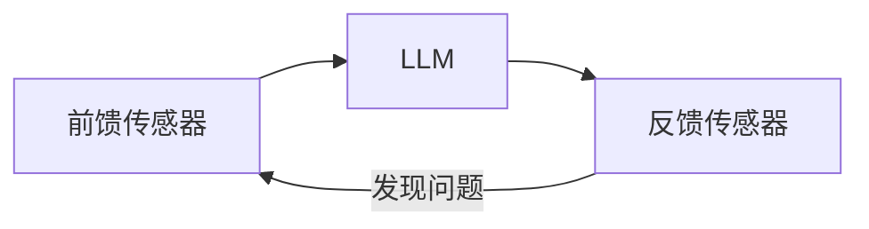

---
{"publish":true,"created":"2026-06-07T09:12:38.382+08:00","modified":"2026-06-07T10:31:10.058+08:00","cssclasses":""}
---

## 引言

当我们使用 Cursor、Claude Code、Codex 等 AI Coding Agent 的时候，经常会遇到一种情况：

为什么别人使用 AI Coding 写出的代码又快又好，代码优雅、结构清晰、可维护性强？

而我们让 AI 生成的代码虽然能跑，却总是伴随着各种问题：

- 缺少注释
    
- 不使用已有组件库
    
- 重复造轮子
    
- 代码可读性差
    
- 大量防御性代码
    
- 忽视通用工具函数和 Hooks
    
- 不符合团队规范
    
- 修改一个地方影响多个模块
    

明明使用的是同一个模型、同一个 AI Coding 工具，但最终产出的代码质量却相差巨大。

很多人认为这是 Prompt 的差距。

但实际上，更大的差距往往来自于：

> 你是否拥有一套完整的 Harness（治理系统）。

## 什么是 Harness

Harness 在英语中原意是：

> 马鞍、缰绳、控制装置。

在骑马时，骑手并不会直接控制马的每一块肌肉，而是通过 Harness 来约束和引导马的行为。

```text
骑手
 ↓
Harness
 ↓
马
```

AI Coding 也是一样。

开发者并不会直接控制大模型每一步推理过程，而是通过各种规则、约束和反馈机制去引导它。

```text
开发者
 ↓
Harness
 ↓
LLM
```

因此：

> Harness 本质上是一套用于约束、监控和纠正大模型行为的工程系统。

它并不是某个具体工具。

而是一套完整闭环：

```text
前馈约束
    ↓
模型执行
    ↓
结果检查
    ↓
反馈修正
```

在 AI Coding 场景中，一个最基础的 Harness 通常包含三个部分：

||前馈传感器|LLM|反馈传感器|
|---|---|---|---|
|作用|前置调节|核心推理|反馈纠正|
|常见代表|AGENTS.md、CLAUDE.md|Claude Code、Codex、Cursor 等|ESLint、Playwright、AI Review、人工 Review|

对应流程如下：



其中：

- 前馈负责约束模型行为
    
- LLM 负责执行任务
    
- 反馈负责检查结果
    

三者共同形成闭环。

## AI Coding 的核心矛盾

很多人认为：

```text
代码质量 = 模型能力
```

实际上：

```text
代码质量 = 模型能力 × 治理能力
```

举个例子：

```text
GPT-5
×
0.3 的治理能力

=
3 分代码
```

```text
Claude
×
0.9 的治理能力

=
9 分代码
```

模型决定了能力上限。

而 Harness 决定了输出下限。

换句话说：

> 决定 AI Coding 上限的是模型，决定 AI Coding 下限的是 Harness。

这也是为什么同样使用 Claude Code，有人写出来的是工程代码，有人写出来的是 Demo 代码。

差距并不完全来自模型本身，而是来自背后的治理体系。

## 反馈传感器的两种类型

很多人会关注 Prompt，却忽略反馈系统的重要性。

实际上：

> AI Coding 的质量，很大程度上取决于反馈质量。

反馈传感器主要可以分为两类。

### 推理型反馈

通过大模型进行分析判断。

例如：

- AI Review
    
- AI Code Review
    
- UI 截图分析
    
- AI 视觉检查
    

特点如下：

|优点|缺点|
|---|---|
|理解语义能力强|成本较高|
|能发现复杂问题|存在误判|
|可处理未知场景|不够稳定|

### 计算型反馈

通过程序规则进行判断。

例如：

- ESLint
    
- Prettier
    
- TypeScript
    
- 单元测试
    
- Playwright 断言
    

特点如下：

|优点|缺点|
|---|---|
|成本低|规则有限|
|确定性强|无法理解复杂语义|
|速度快|场景受限|

实际工程中，最好的方式通常不是二选一，而是：

> 推理型反馈 + 计算型反馈混合治理。

## 我们为什么需要 Harness

很多人会有一个误区：

> 大模型已经很聪明了，还需要治理吗？

答案是：

需要，而且会越来越需要。

### 大模型很聪明，但不一定听话

大模型具备很强的推理能力。

但它并不一定按照你的想法执行。

例如：

你希望：

- 优先使用组件库
    
- 优先复用 Hooks
    
- 优先使用已有工具函数
    
- 不允许重复造轮子
    

但模型可能：

- 新建一个组件
    
- 新写一个 Hook
    
- 新建一个工具函数
    

因为在它看来：

这样也能够完成任务。

而 Harness 的作用，就是不断缩小这种偏差。

### 大模型也会犯错

即使是目前最先进的模型：

- Claude
    
- GPT
    
- Gemini
    

依然会出现：

- 幻觉
    
- API 误用
    
- 推理错误
    
- 架构偏移
    
- 上下文理解错误
    

因此：

> AI Coding 从来不是一次生成，而是持续纠偏。

### Token 成本控制

很多团队喜欢把所有规则全部塞进 AGENTS.md。

最终变成：

```text
AGENTS.md
3000 行规则
```

这样会导致：

- Token 消耗急剧增加
    
- 推理速度下降
    
- 无关规则干扰模型决策
    

Harness 的另外一个价值就在于：

> 用工程化方式降低推理成本。

## Harness 的三层演化

随着项目规模扩大和团队协作复杂度提升，Harness 通常会经历三个阶段。

### 第一层：一次性质量闭环

最基础的 Harness：

```text
规则
 ↓
LLM
 ↓
检查
 ↓
修复
```

例如：

```text
AGENTS.md
    ↓

Claude Code

    ↓

ESLint

    ↓

重新修复
```

这一层已经可以解决很多问题：

- 格式统一
    
- 类型检查
    
- 基础代码规范
    
- 简单错误修复
    

事实上：

只要你已经在使用：

- AGENTS.md
    
- ESLint
    
- Prettier
    
- TypeScript
    

那么你已经拥有了一个最基础的 Harness。

但是它存在一个明显问题：

> 所有经验都停留在当前会话。

会话结束之后：

- 错误不会被记住
    
- 规则不会被演化
    
- 经验不会被积累
    

因此，它仍然属于一次性治理。

### 第二层：经验持久化治理

这一层的核心目标是：

> 将反馈转化为长期记忆，并通过 Context Engineering 持续影响后续推理。

相比第一层：

这里的重点已经不再是单纯增加检测器。

而是引入：

- 错误记忆
    
- 规则沉淀
    
- 漂移治理
    
- 长期反馈
    

#### 前馈：规则路由与规则分片

很多团队喜欢维护一个超大的规则文件：

```text
AGENTS.md

3000+ 行
```

这种方式存在两个问题：

1. Token 消耗巨大
    
2. 不同规则互相干扰
    

更合理的方式是：

将 AGENTS.md 设计成一个入口文件。

职责仅包括：

- 核心原则
    
- 路由导航
    
- 规则索引
    

控制在：

```text
200 行以内
```

例如：

```text
AGENTS.md

React开发 → react.md

表单开发 → form.md

测试开发 → test.md

组件开发 → component.md
```

模型根据当前任务动态读取规则。

而不是一次性加载全部规则。

#### 规则分片

例如：

```text
rules/

├── react.md
├── hooks.md
├── component.md
├── form.md
├── test.md
├── api.md
```

每份规则只关注单一主题。

这种设计类似于前端模块化思想：

- 降低复杂度
    
- 提高维护性
    
- 降低 Token 消耗
    

#### 目录级规范

除了项目级规则之外，还可以增加目录级规则。

例如：

```text
components/
    AGENTS.md

hooks/
    AGENTS.md

utils/
    AGENTS.md
```

目录级规则通常包含：

- 当前目录用途
    
- 可复用资源
    
- 编码规范
    
- 注意事项
    

例如 Hooks 目录：

```text
本目录已有：

useRequest
usePagination
useThrottle
useDebounce
```

这样模型就能够优先复用已有能力。

而不是重新实现。

这份文档不仅可以服务 AI。

同时也可以服务团队新人。

#### 反馈：规则沉淀

完成前馈改造后，反馈才能真正形成价值闭环。

理想流程如下：

```text
问题
 ↓
归因
 ↓
生成规则
 ↓
写入规则库
```

例如连续发现：

```text
表单逻辑重复开发
```

则自动沉淀规则：

```text
涉及表单场景时
优先复用 FormContainer
```

下次生成时自动生效。

此时：

系统开始拥有长期记忆。

不同 AI Coding 工具对此支持程度不同。

例如：

Claude Code 具备较强的生命周期 Hook 能力，可以自动触发反馈流程。

而 Codex 更偏向任务执行，需要通过提示词约束或者人工触发治理流程。

但无论实现方式如何变化，其本质都是：

> 将错误转化为规则，将规则转化为长期资产。

### 第三层：多模态治理体系

第三层关注的已经不是：

> 代码是否正确。

而是：

> 最终结果是否正确。

因为：

```text
代码正确
≠
用户体验正确
```

例如：

- ESLint 通过
    
- TypeScript 通过
    
- 单元测试通过
    

但依然可能出现：

- UI 错位
    
- 样式异常
    
- 响应式布局失效
    
- 首屏性能下降
    
- 用户关键路径受损
    

这些问题往往无法通过传统代码检查发现。

#### 从代码治理到结果治理

第一层关注：

```text
代码能不能运行
```

第二层关注：

```text
代码是否符合团队规范
```

第三层关注：

```text
最终交付结果是否符合预期
```

这是一次治理重心的升级。

#### 引入视觉传感器

前端本质上是视觉驱动的。

因此：

视觉反馈成为第三层 Harness 的核心能力之一。

例如：

- Playwright
    
- Screenshot Diff
    
- AI Vision Review
    
- 多模态模型
    

形成新的治理闭环：

```text
代码
 ↓
浏览器运行
 ↓
截图
 ↓
视觉分析
 ↓
反馈修正
```

#### UI 还原度检测

过去很多 AI Coding 工具最大的短板之一：

就是无法准确判断页面是否真正符合设计稿。

但随着 GPT-5、Claude 等模型视觉能力增强。

现在已经可以：

- 自动截图
    
- 自动比对
    
- 自动分析差异
    
- 自动生成修复建议
    

从而将原本主观的视觉判断逐渐量化。

例如：

```text
UI还原度

95%
```

这种能力让 Harness 开始具备结果层面的量化治理能力。

#### 规则生命周期治理

随着时间推移：

规则会越来越多。

最终出现：

```text
规则爆炸
```

问题。

因此需要建立规则治理体系。

包括：

新增规则：

- 哪些问题值得沉淀？
    

淘汰规则：

- 哪些规则已经失效？
    

合并规则：

- 哪些规则本质重复？
    

如果缺乏治理体系。

那么随着系统长期演化：

规则库最终会变成新的技术债务。

## Harness 的本质是什么

如果把 Harness 抽象到更高层来看。

它实际上是在解决一个问题：

> 如何让一个强大但不确定的大模型，在长期工程实践中，持续输出符合团队预期的结果。

模型负责提供能力。

Harness 负责约束能力。

模型负责创造可能性。

Harness 负责维持秩序。

因此：

Harness 从来都不是一个工具。

它更像是一套工程治理思想。

## 总结

很多人认为：

AI Coding 的核心是 Prompt。

但实际上：

Prompt 只是 Harness 的组成部分之一。

真正决定 AI Coding 质量的，并不仅仅是模型能力。

而是：

```text
模型能力 × 治理能力
```

模型决定了 AI Coding 的上限。

Harness 决定了 AI Coding 的下限。

随着 AI Coding 的普及，未来团队之间真正拉开差距的，或许不再是谁拥有更强的大模型。

而是谁拥有更成熟、更稳定、更可持续演化的 Harness 体系。

从某种意义上来说：

AI Coding 正在从“代码生成”时代，走向“工程治理”时代。

而 Harness，正是这场演化的核心。