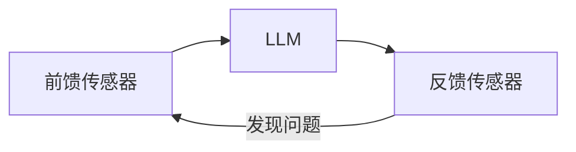

---
{"publish":true,"created":"2026-06-07T09:12:38.382+08:00","modified":"2026-06-07T10:53:57.361+08:00","cssclasses":""}
---

# AI Coding 不会拉开差距，Harness 才会

## 引言

当我们使用 Cursor、Claude Code、Codex 等 AI Coding Agent 的时候，经常会遇到一种情况：

为什么别人使用 AI Coding 写出的代码又快又好，代码优雅、结构清晰、可维护性强？

而我们让 AI 生成的代码虽然能跑，却总是伴随着各种问题：

- 缺少注释
- 不使用已有组件库
- 重复造轮子
- 代码可读性差
- 大量防御性代码
- 忽视通用工具函数和 Hooks
- 不符合团队规范
- 修改一个地方影响多个模块

明明使用的是同一个模型、同一个 AI Coding 工具，但最终产出的代码质量却相差巨大。

很多人认为这是 Prompt 的差距。

但实际上，更大的差距往往来自于：

> 你是否拥有一套完整的 Harness（治理系统）。

# 什么是 Harness

Harness 在英语中原意是：

> 马鞍、缰绳、控制装置。

在骑马时，骑手并不会直接控制马的每一块肌肉，而是通过 Harness 来约束和引导马的行为。

```text
骑手
 ↓
Harness
 ↓
马
```

AI Coding 也是一样。开发者并不会直接控制大模型每一步推理过程，而是通过各种规则、约束和反馈机制去引导它。

```text
开发者
 ↓
Harness
 ↓
LLM
```

因此：

> Harness 本质上是一套用于约束、监控和纠正大模型行为的工程系统。

它并不是某个具体工具，而是一套完整闭环：

```text
前馈约束
    ↓
模型执行
    ↓
结果检查
    ↓
反馈修正
```

在 AI Coding 场景中，一个最基础的 Harness 通常包含三个部分：

|      | 前馈传感器 | LLM | 反馈传感器 |
|--------|--------|--------|--------|
| 作用 | 前置调节 | 核心推理 | 反馈纠正 |
| 常见代表 | AGENTS. Md、CLAUDE. Md | Claude Code、Codex、Cursor | ESLint、Playwright、AI Review |

对应流程如下：



其中：

- 前馈负责约束模型行为
- LLM 负责执行任务
- 反馈负责检查结果

三者共同形成闭环。

# 反馈传感器的两种类型

很多人会关注 Prompt，却忽略反馈系统的重要性。

实际上：

> AI Coding 的质量很大程度上取决于反馈质量。

反馈传感器主要可以分为两类：

## 推理型反馈

通过大模型进行分析判断。

例如：

- AI Review
- AI Code Review
- UI 截图分析
- AI 视觉检查

特点：

| 优点 | 缺点 |
|--------|--------|
| 理解语义能力强 | 成本较高 |
| 能发现复杂问题 | 存在误判 |
| 可处理未知场景 | 不够稳定 |

## 计算型反馈

通过程序规则进行判断。

例如：

- ESLint
- Prettier
- TypeScript
- 单元测试
- Playwright 断言

特点：

| 优点 | 缺点 |
|--------|--------|
| 成本低 | 规则有限 |
| 确定性强 | 无法理解复杂语义 |
| 速度快 | 场景受限 |

实际工程中：

最好的方式通常是：

> 推理型 + 计算型混合治理。

# 我们为什么需要 Harness

很多人会有一个误区：

> 大模型已经很聪明了，还需要治理吗？

答案是：

需要，而且越来越需要。
## 大模型很聪明，但不一定听话

大模型具备很强的推理能力，但它并不一定按照你的想法执行。

例如：

你希望：

- 优先使用组件库
- 优先复用 Hooks
- 不允许重复造轮子

但模型可能：

- 新建一个组件
- 新写一个 Hook
- 新造一个工具函数

因为在它看来，这样也能完成任务。

而 Harness 的作用，就是不断缩小这种偏差。
## 大模型也会犯错

即使是最先进的模型：

- Claude
- GPT
- Gemini

依然会出现：

- 幻觉
- 推理错误
- API 误用
- 架构偏移

因此：

> AI Coding 不是一次生成，而是持续纠偏。

## Token 成本控制

很多团队喜欢把所有规则全部塞进 AGENTS. Md。

结果：

```text
AGENTS.md
2000行
```

每次对话都需要读取。

大量 Token 被浪费。

Harness 的本质其实也是：

>  用工程化方式降低推理成本。

# Harness 的三层演化

随着团队规模和项目复杂度提升，Harness 通常会经历三个阶段。

# 第一层：一次性质量闭环

最基础的 Harness：

```text
规则
 ↓
LLM
 ↓
检查
 ↓
修复
```

例如：

```text
AGENTS.md
    ↓

Claude Code

    ↓

ESLint

    ↓

重新修复
```

这一层已经可以解决很多问题：

- 格式统一
- 类型检查
- 基础代码规范

事实上：

只要你在使用：

- AGENTS. Md
- ESLint
- Prettier

那么你已经拥有了一个最基础的 Harness。

但是它有一个明显缺点：

> 所有经验都是会话级的。

会话结束后：

经验就消失了。

# 第二层：经验持久化治理

第二层最大的变化是：

> 将反馈变成记忆。

核心目标：

- 错误沉淀
- 规则沉淀
- 漂移治理
- 长期反馈

## 前馈：规则路由 + 规则分片

很多团队喜欢：

```text
AGENTS.md

3000行规则
```

这样会导致：

- Token 暴涨
- 推理变慢
- 规则互相干扰

更好的方式是：

### 路由文件

```text
AGENTS.md
```

仅负责：

- 核心原则
- 规则导航
- 文件索引

控制在：

```text
200行以内
```

### 规则分片

例如：

```text
rules/

├── react.md
├── hooks.md
├── ui.md
├── test.md
├── api.md
```

需要时再读取，而不是全部加载。

一个可参考的模板：

```markdown
# 核心规则

### 项目介绍

### 架构介绍

...

# 规则路由（按需引入）

## 样式

@./rules/styles.md


## 组件设计

@./rules/components.md

...

```

### 目录级规范

例如：

```text
components/
    AGENTS.md

hooks/
    AGENTS.md

utils/
    AGENTS.md
```

告诉模型：

这个目录：

- 是干什么的
- 有哪些工具
- 有哪些约束
- 应该如何使用

这样模型无需扫描整个项目。

## 反馈：沉淀规则

当反馈发现问题后：

```text
问题
 ↓
归因
 ↓
生成规则
 ↓
写入规则库
```

例如：

连续发现：

```text
表单重复造轮子
```

自动沉淀：

```text
涉及表单开发时
优先使用 FormContainer
```

下次自动生效。

这是，系统开始拥有长期记忆。

# 第三层：多模态 + 持久化治理体系

第三层关注的已经不是：

> 代码是否正确

而是：

> 最终结果是否正确

因为：

代码正确 ≠ 用户体验正确

例如：

- ESLint通过
- TypeScript通过
- 单测通过

但：

- UI 错位
- 按钮消失
- 样式异常
- 首屏性能下降

依然可能发生。

## 引入视觉传感器

在前端这个领域，引入视觉传感器是验证实现效果的最好办法，目前常见的一些方法有：

- Playwright
- 截图对比
- AI Vision Review
- 多模态模型

形成：

```text
代码
 ↓
浏览器运行
 ↓
截图
 ↓
视觉分析
 ↓
反馈
```


## UI 还原度检测

过去：

AI 很难判断：

页面是否真的符合设计稿。

但随着 GPT-5、Claude 等模型视觉能力增强。

已经可以：

- 自动截图
- 自动比对
- 自动分析差异

从而量化：

```text
UI还原度
```

据笔者实践，目前 Codex 的视觉能力已经非常强大，通过 pxmatch 等对比库可以实现一套视觉对比系统。

## 规则生命周期治理

第三层另一个重要的任务在于：规则的治理。

随着时间推移，规则会越来越多。

最终会出现：

```text
规则爆炸
```

因此：
### 规则新增

哪些问题值得沉淀？

### 规则淘汰

哪些规则已经过时？

### 规则合并

哪些规则实际上是重复的？

只有这样：

Harness 才能长期演化。

# 总结

很多人认为：

AI Coding 的核心是 Prompt。

但实际上：

Prompt 只是 Harness 的一部分。

真正决定 AI Coding 上限的，

并不是模型本身，

而是你是否拥有一套持续约束、持续反馈、持续演化的治理体系。

```
Agent = Model + Harness
```

从本质上看：

Harness 其实是在解决一个问题：

> 如何让一个强大的、不确定的大模型，在长期工程实践中，持续输出符合团队预期的结果。

而这也是 AI Coding 从“玩具”走向“工程化生产力”的关键一步。

# 参考

- https://www.langchain.com/blog/the-anatomy-of-an-agent-harness
- https://martinfowler.com/articles/harness-engineering.html