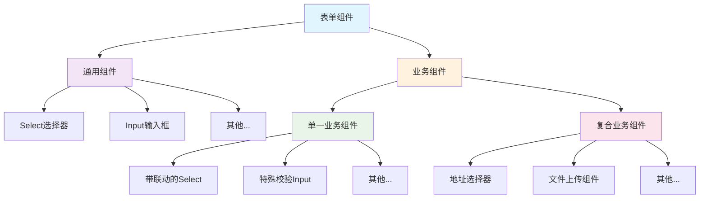
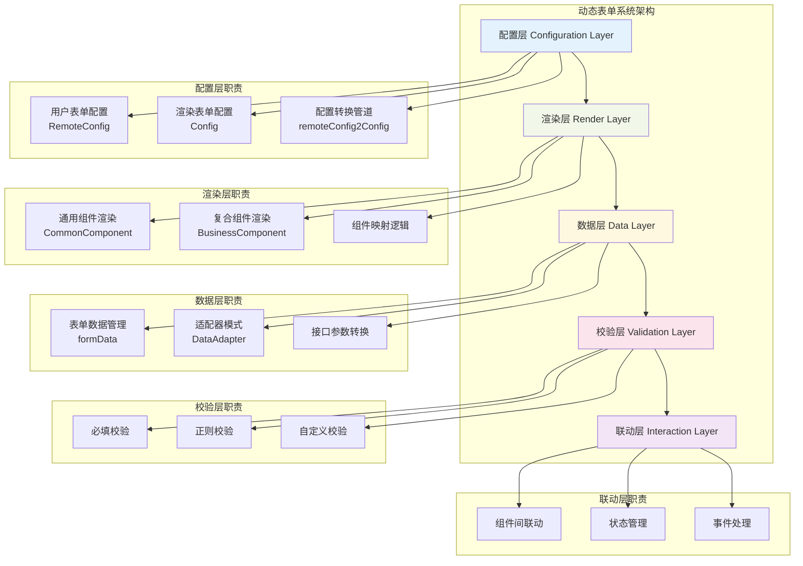
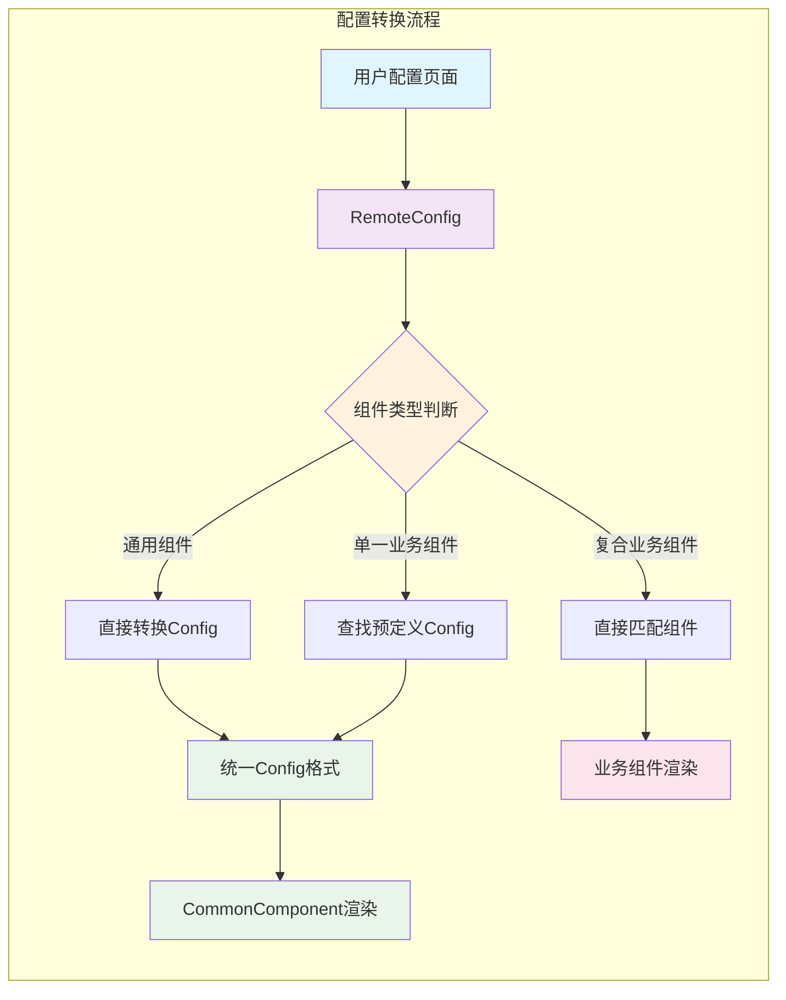
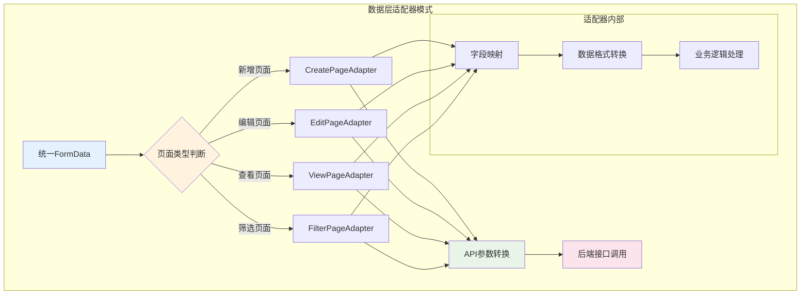
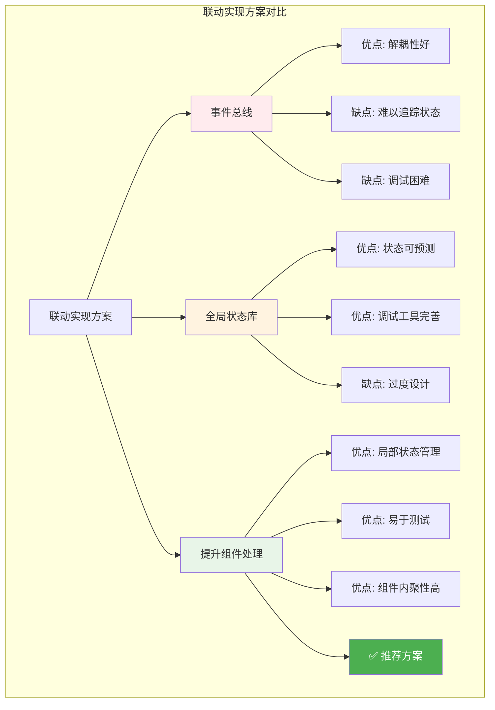

---
{"publish":true,"created":"2025-10-12T11:18:18.000+08:00","modified":"2026-01-24T13:38:36.606+08:00","cssclasses":""}
---

## 业务背景

最近需要实现一个动态表单系统，该表单会被多个页面使用，并且存在形式多样（新增表单、修改表单、查看表单、筛选表单等），并且该表单需要支持动态配置。

用户可以在配置页面进行表单配置，可以控制表单展示的组件、名称、是否必填、正则校验等配置信息，这些配置信息会映射到实际业务场景下的页面中。

对于表单组件主要包含通用组件和业务组件两种，其中业务组件又分为单一组件和复合组件。

- 通用组件：如 select选择器、input 输入组件等通用逻辑的组件。
- 业务组件：业务特定的组件，包含特定的业务逻辑。
	- 单一业务组件：和通用组件相似，只包含一个输入组件，但是可能包含特殊逻辑，比如联动等。
	- 复合业务组件：内部由多个组件组成的复杂组件，通常包含个性化业务逻辑。

对于通用组件，通常是允许用户自行配置，且支持用户配置所有内容，而对于单一业务组件和复合业务组件，通常是由脚本直接写入，前者可以允许修改部分配置项字段，比如表单项名称等，后者基本完全不允许用户手动修改。



## 难点分析

这个业务需求的核心难点在于几个层面：

- 可维护性：动态配置表单需要支持多个页面复用，并且展示形态不同（筛选条件表单、查看、新增等），当配置项过多时，怎么保证代码的可维护性？
- 可观测性：在这个复杂的动态表单系统中，怎么可以很好地观测内部状态？怎么清晰地观测配置与渲染组件的映射关系等。
- 可测试性：表单系统在不同页面、不同形态时行为可能不相同，怎么保证代码隔离性？避免改了一个地方，另一个地方逻辑又被破坏了，加大测试难度。
- 可扩展性：怎么保证表单系统扩展性？比如未来能够支持更多配置项，包括简单组件（选择器等）和复合组件。

基于此，需要借助一些设计模式与架构设计思想来进行设计。

## 系统架构分层

```
--------------------------------
|            配置层             ｜
--------------------------------
--------------------------------
|            渲染层             ｜
--------------------------------
--------------------------------
|            数据层             ｜
--------------------------------
--------------------------------
|            校验层             ｜
--------------------------------
--------------------------------
|            联动层             ｜
--------------------------------

```




这个架构使用到了一些思想：

- 配置驱动开发
- 单一职责与关注点分离

#### 配置层

配置层分为两方面：
- 用户表单配置：即远程配置项，由脚本初始化，用户在配置页面配置后生成是配置对象。
- 渲染表单配置：与用户表单配置不同的是，渲染表单配置关注渲染组件，即渲染哪个组件等，通过渲染表单配置映射为实际的组件。

用户配置的信息会被转换成相应的数据，JSON Schema 如下

```typescript
export type RemoteConfig = {
	key: string
	component: 'select' | 'input' | 'xxx'
	name: string
	disabledName: boolean
	required: boolean
	disabledRequired: boolean
	filter: boolean
	disabledFilter: boolean
	regexp?: string
	// ...
}
```

用户配置项关注用户配置相关数据，比如是否必填、是否作为筛选项等等，用户配置的配置项会以上述 JSON Schame 的形式保存。

用户配置项并不能直接作为我们表单系统的组件配置项，前面说过，表单组件可以拆分成通用组件、单一业务组件和复合组件，其中通用组件和单一业务组件，本质上就只包含一种组件，我们可以直接将其抽成渲染组件配置项，交由渲染层统一处理。

```typescript
// 业务组件配置（通用组件、单一业务组件）
export type Config = {
	key: string
	component?: 'select' | 'input' | 'xxx'
	name: string
	props: {
	  // ...
	},
	on: {
	  // ...
	}
	// ...
}

// 所有单一业务配置项
// 采用工厂模式。避免配置对象互相干扰
function getAllConfig(pageType: PageType):Record<string, Config>{
	// 通用单一业务配置项
	const configMap:Record<RemoteConfig['key'], Config> = {
		service_customer: {
			key: string,
			component: 'select',
			name: '服务客户',
			props: {
			  // ...
			},
			on: {
			  // ...
			}
			// ...
		}
		//...
	}
	// 个性化逻辑处理
	// ...
	return configMap
}
```

对于通用组件和单一业务组件，我们从接口拿到 RemoteConfig 后，需要进一步转换成 Config，这可以编写一个管道函数来这个功能。





```typescript
const commonComponent = ['select', 'input', /* ... */]

// 管道专门将通用组件和单一业务组件这两种类型的远程配置转成对应的组件配置
function remoteConfig2Config(pageType: PageType, remoteConfig: RemoteConfig):Config{
	let config = {}
	
	if(commonComponent.includes(remoteConfig.component)){
		// 对于通用组件remoteConfig，直接将转换成Config即可
		config.name = remoteConfig.name
		// ...
	}else {
		// 对于单一业务组件，应该通过找到匹配的Config
		const allConfig = getAllConfig(pageType)
		config = allConfig[remoteConfig.key]
	}
	
	return config
}
```

对于复合业务组件，它通常包含复杂的、业务定制化的逻辑，因此它通常是由初始化脚本直接写入，并且不支持用户手动配置，因此无需关注配置，提前抽取成业务组件，然后通过 remoteConfig.key 直接匹配渲染业务组件即可。
#### 渲染层

渲染层主要负责组件渲染，这一层的核心是将配置映射为真实的组件。
前面我们说过组件可以分为通用组件、单一业务组件和复合业务组件，系统采用配置驱动开发的思想，通用组件和单一业务组件已经在配置层就从 RemoteConfig 转换成Config，而渲染层，则是将 Config 进一步转换成组件。

```
// 远程配置Schema转换成组件渲染配置Schema
RemoteConfig  ->  Config
```

事实上，单一业务组件是通用组件的超集，通常来说，它是通用业务组件加上特殊的业务逻辑。比如，业务要求某个 select 选择时需要联动另一个 select 组件。因此**我们只需要提取一个通用的渲染组件来处理单一业务组件和通用组件这两种类型。**

```ts
export const CommonComponent = {
	props:{
		config: Config
	},
	data(){
		return {
		}
	}
	render(h){
		const children = [/* ... */] // 逻辑处理
		const attrs = {
			props:{
			...config.props,
			...this.$attrs
			},
			on:{
				change(){
				 // render方式的vue组件需要自己实现双向绑定
				 // this.$emit(/* ... */)
				}
			}
		}
		h(config.component, attrs, children)
	}
}
```

虽然架构采用配置驱动开发的思想，但是对于复合组件来说，还是应该抽取出单独的组件，而不是统一采用配置来解决，配置不是“银弹”，不应该追求一套方式解决所有问题。

```html
<div v-for="config in configList" :key="config.key">
	<!-- 业务组件 -->
	<ServiceCustomer v-if="config.key === 'ServiceCustomer'" :config="config"/>
	<!-- 通用组件 -->
	<CommonComponent v-else :config="config">
</div>
```

虽然都用的是 Vue，但是在渲染层采用了 render 和 template 两种写法，前者运用在通用组件渲染上，因为那部分“动态”特性居多，而在这里，更适合模板语法，在不同场景下使用不同 Vue 风格来编写代码，发挥各自的优势。

### 数据层

系统实现的其中一个难点在于，表单系统处于不同页面或不同形态时，后端接口传参的字段可能各不相同，如何避免写一堆 if... else，保证代码可读性？如何确保各种场景下的处理逻辑分离，避免修改一处，另一处正常逻辑又被破坏了？这体现在系统的可测试性。

我的思路是，在配置层和渲染层，始终只有一个 formData 来保存表单数据，并且通过 TS 进行类型强约束。

在数据层，借助适配器模式，首先区分形态，其次区分页面，最后再将整个表单进一步细分为一个个“小逻辑”，借助函数式编程的思想，每个“小逻辑”就是一个函数。

这种实现方式能有效地避免耦合，保持职责单一，例如，在渲染层、联动层等其他层级进行逻辑处理时，不需要考虑后端接口参数的影响，保持统一的代码逻辑，只需要关注自身的职责，接口参数交由数据层处理，互相解耦。



### 校验层

校验层相对简单，根据 Config 配置，在 CommonCoponent 进行校验，常用的校验有必填、正则表达式等。

```ts
export const CommonComponent = {
	props:{
		config: Config
	},
	data(){
		return {
		}
	},
	methods:{
		validate(){
			/* ... */
		}
	}
	render(h){
		const children = [/* ... */] // 逻辑处理
		const attrs = {
			props:{
			...config.props,
			...this.$attrs
			},
			on:{
				change(){
				 // render方式的vue组件需要自己实现双向绑定
				 // this.$emit(/* ... */)
				},
				blur(){
					this.validate()
				}
			}
		}
		h(config.component, attrs, children)
	}
}
```

而对于复合组件，则通过暴露 validate 函数来实现校验。

```js
defineExpose({
	validate(){
		/*...*/
		return true
	}
})
```

### 联动层

实现联动的方式通常有三种：
- 事件总线
- 全局状态库
- 提升组件处理

事件总线首先需要排除，当事件比较多时，事件状态的追踪成本非常高，可维护性、可观测性差，而全局状态库（如 Vuex、Pinia、redux 等）其实可以看做是组件树最顶层的 Context（react）或有状态的Provide（Vue），在跨页面状态共享、保存快照等方面具有优势，但是在这个表单系统中，我还是更加偏好局部状态而不是全局状态，因此选择第三中，使用一个组件来专门处理联动。



```vue
<template>
	<!-- 实际处理组件上层插入一个专门用于联动的组件 -->
	<comp v-bind="$attrs" v-on="$listeners" v-model="formData" />
</template>

<script setup>
	const formData = ref({})
	
	// 处理联动
	watch(/**/)
</script>
```

## 总结

面对这样复杂的一个动态表单系统，通过配置层、渲染层、数据层、校验层和联动层五层架构设计实现。来实现单一职责与关注点分离原则，每层只关注自身的职责且互相之间隔离，这样的设计有利于实现低耦合高内聚的代码。

首先，拆分业务，分成通用组件、单一业务组件和符合业务组件，在配置层，将通用组件用户配置直接转换成组件渲染配置对象，对于单一业务组件则是通过用户配置 key 找到提前定义的渲染配置对象，然后两种均在渲染层由统一的渲染组件进行渲染，对于复合业务组件则抽成单独的组件渲染。

在前后端接口交互上，通过数据层专门处理数据转换问题，采用适配器模式，使得其他层无需关注数据格式，由数据层适配器统一转换即可。

在校验层，对于通用组件和单一业务组件直接在统一渲染组件中进行校验处理，对于符合业务组件则通过暴露 validate 函数，在上层函数统一进行调用校验处理。

在联动层，常用的联动方式有事件总线、全局状态库和提升组件处理三种方式，出于可维护性和可扩展性等方面考虑，采用提升到组件中专门进行联动处理这一方式。

系统整体上采用配置驱动开发的思路，但是并未完全遵循，比如复合业务组件是直接抽取成单独的组件处理，这是对可维护性的妥协与平衡，配置不是“银弹”，过分地追求配置化反而会影响保证可维护性的初衷。

该架构设计为系统筑牢了可维护性、可扩展性、可测试性与可观测性的基础底线，确保系统在长期迭代中保持稳定与高效。

## 反思

### 后续发展

得力于良好的设计，在后面开发阶段，突然得知需要将功能迁移到移动端上，基于前面的五层架构设计，导致迁移成本非常低，只需要在每层处理 PC 端组件与移动端组件之间的差异即可，其他如联动、校验、配置等逻辑都能够复用，整体开发时间比预期提升 60%。

然而，在开发的中后期阶段，由于需求管理失控，不断地需求变更和新需求插入，导致开发时间紧张，最终在时间压力下导致写了不少不符合规范的代码，破坏了系统架构。

事后分析，首要责任在于项目需求管理上，然而作为前端开发工程师，我们只能管好自己，从自身角度出发来改进。在架构设计上，没有提前预料到极端场景、没有赋予系统架构足够的弹性，同时架构防御性不足，例如单一业务组件对应的预定义的 Config 配置项可以被轻易的修改，这破坏了职责单一原则，导致代码耦合，此外，在性能上也欠缺考虑，比如 select 组件在数万 option 选项下容易造成卡顿，需要采用虚拟滚动或搜索方案等。

```js
// 项目紧急开发中破坏架构的代码
watch(()=>formData.type, (type)=> {
	// 直接修改了配置项
	configMap.xxx.props.options = []
})
```

### 优化方向

总的来说，我认为前面的架构设计在下面几方面考虑欠缺：
- 防御性
- 弹性
- 性能

#### 防御性

架构的防御性的强弱决定架构是否容易被破坏，在前面的设计中，通过 TS + JSDoc 来实现强性+软性类型约束，然而，TS 本身是编译时工具，并且可以通过 any 来绕开类型约束，因此在开发中仍然可以进行破坏性更改，更好的方法是再加上 `Object.freeze()` 来进行运行时强约束。

```ts
// 所有单一业务配置项
// 采用工厂模式。避免配置对象互相干扰
function getAllConfig(pageType: PageType):Record<string, Config>{
	// 通用单一业务配置项
	const configMap:Record<RemoteConfig['key'], Config> = {
		service_customer: {
			key: string,
			component: 'select',
			name: '服务客户',
			props: {
			  // ...
			},
			on: {
			  // ...
			}
			// ...
		}
		//...
	}
	// 个性化逻辑处理
	// ...
	return Object.freeze(configMap)
}
```

#### 弹性

当然，不能一味地追求防御性，我们还得考虑弹性，以便支持更多复杂、极端的场景。比如，某些情况下可能确实需要修改配置项，那么我们还是需要留下“逃生通道”。

```ts
// 高阶更新函数
export function updateConfig(configMap: ConfigMap, updater: (draft: ConfigMap) => void): ConfigMap {
  // 拷贝一个可变副本
  const draft: ConfigMap = _.deepClone(configMap)
  logger.log('updateConfig start:', configMap)

  // 用户在 draft 上修改
  updater(draft)

  // 更新并冻结
  const newConfigMap = Object.freeze(draft)
  logger.log('updateConfig end:', newConfigMap)
  return newConfigMap
}
```

updateConfig 是一个高阶函数，接受一个 updater 参数，它不关心 updater 是如何修改 configMap，只提供统一修改的接口，并且使用不可变数据的理念，避免副作用，提高可测试性。

如果想进一步收口修改配置和联动，避免渲染层和配置层耦合，可以实现一个配置观察者。

```typescript
// observer.ts
import _ from 'lodash'

export class ConfigObserver {
    observeSet = new Set<( newConfig: any)=> any>()
    config:any

    constructor(config){
        this.config = config
    }

    addPlugin(fn:((newConfig: any)=> any)){
        this.observeSet.add(fn)
    }

    trigger(){
        console.log('ConfigObserver trigger:oldConfig ', this.config)

        const newConfig = _.cloneDeep(this.config)
        this.observeSet.forEach(fn => fn( newConfig))

        console.log('ConfigObserver trigger:newConfig ', newConfig)
        return newConfig
    }

    clear(){
        this.observeSet.clear()
    }
}

```

```typescript
// form.vue
const configObserver = new ConfigObserver(configMap)

const setupConfigPlugins = () => {
  if (!configObserver) return
  
  configObserver.addPlugin(()=>{/*...*/})
  configObserver.addPlugin(()=>{/*...*/})
  configObserver.addPlugin(()=>{/*...*/})
}
setupConfigPlugins()

// 使用ConfigObserver处理配置联动
watch(
  formData,
  () => {
    if (configObserver) {
      // 通过ConfigObserver触发配置更新
      matchConfigMap.value = configObserver.trigger()
    }
  },
  { deep: true }
)

onUnmounted(() => {
  // 避免内存泄漏
  if (configObserver) {
    configObserver.clear()
  }
})
```

通过插件插拔的方式，来避免渲染层直接操作配置层。从代码上来看，这相当于多了一个中间层，会增加少许代码复杂度，但是从架构层面来看，它能避免渲染层与配置层的耦合，并且通过插件的方式，有利于实现AOP切面编程，例如在观察者被触发执行时，日志记录每个插件执行前后配置项的值。

此外，在 config 配置中也应该提供更多弹性空间，比如 select options 支持函数形式：

```ts
function getAllConfig(pageType: PageType):Record<string, Config>{
	// 通用单一业务配置项
	const configMap:Record<RemoteConfig['key'], Config> = {
		service_customer: {
			key: string,
			component: 'select',
			name: '服务客户',
			props: {
			  options: (pageType:PageType, /*...*/)=>{
			  	const options = []
			  	// ...逻辑处理
			  	return options
			  }
			},
			on: {
			  // ...
			}
			// ...
		}
		//...
	}
	// 个性化逻辑处理
	// ...
	return configMap
}
```

####  性能

性能也是一个值得关注的点，正如前面所说，对于几万条数据的选择器组件来说，渲染时间非常长，用户体验非常差，这需要在渲染层进行处理，实现支持虚拟滚动功能 select 组件，或者是将方案切换成搜索。

此外，在 getAllConfig 函数中可能会进行初始化数据请求，需要注意避免串行请求，即

```js
function getAllConfig(pageType: PageType):Record<string, Config>{
	await http.get(/* ... */)
	await http.get(/* ... */)
	await http.get(/* ... */)
}
```

而是需要进行并行请求，减少请求时间。

```ts
function getAllConfig(pageType: PageType):Record<string, Config>{
	const [result1,result2,result3] = await Promise.all([http.get(/* ... */),http.get(/* ... */),http.get(/* ... */)])
}
```

### 总结

对于这个多页面复用、拥有多形态、动态配置的表单系统，刚开始时设计着重聚焦于可维护性、可观测性、可测试性和可扩展性四个方面，后面随着开发的推进，逐渐优化性能、防御性和弹性方面，从这来看，系统架构设计不是一成不变的，而是随着实际场景的不断变化而不断完善。

这次的经验也可以运用到未来复杂业务系统架构设计上，应该从下面几个方面进行考量：
- 可维护性
- 可扩展性
- 可测试性
- 可观测性
- 防御性
- 弹性
- 性能

而在这个项目上，通过借助了配置驱动、单一职责&关注点分离、FP（函数式编程）、AOP（面向切面编程）、OOP（面向对象编程）等设计思想与原则，以及工厂模式、适配器模式、观察者模式、策略模式等多种设计模式，设计了配置层、渲染层，数据层、校验层，联动层，总共五层划分，有效地实现了系统的高内聚与低耦合。

|     | 实现方式/目的                                       | 设计思想                       |
| --- | --------------------------------------------- | -------------------------- |
| 配置层 | 远程配置 + 本地配置 + 本地业务组件结合                        | 工厂模式、策略模式、纯函数、不可变数据、配置驱动开发 |
| 渲染层 | 负责实际的渲染，采用Vue Template+Render（动+静）结合          | 单一职责（三种类型组件）               |
| 数据层 | 负责前端数据与后端数据相互转换，类似BFF，不过是Frontend for Backend | 适配器模式、FP                   |
| 校验层 | 组件库校验策略 + 自定义组件validate函数                     | 策略模式、管道转换                  |
| 联动层 | 负责组件之间的联动，收口配置修改权限、解耦渲染层和配置层                  | 观察者模式 + 插件机制，OOP、AOP（潜在）   |
