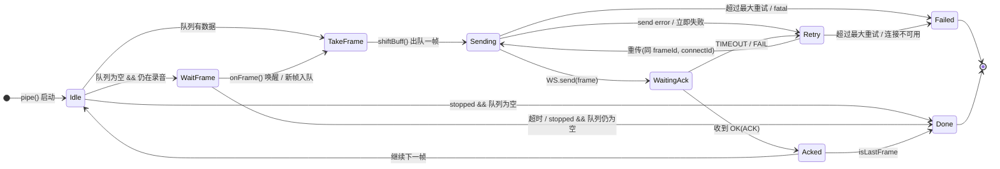

---
{"publish":true,"created":"2026-02-17T19:07:52.000+08:00","modified":"2026-02-19T16:32:18.911+08:00","cssclasses":""}
---


## 引言

最近实现了一套实时录音录入的系统，通过“三段式”的系统设计，最终成功交付，并抗住了线上高峰，记录一下设计思路。

>  三段式：定边界、划层级、找流向
## 需求

简述下需求：业务上需要实现一套实时语言转录的系统，通过大模型进行语音转文字，并且大模型那边对音频流的要求比较严格：

1. 以音频流的形式发送给大模型端进行处理
2. 音频流需要严格保证传递顺序
3. 每一帧长度固定为 3.2 kb 或者 6.4 kb 左右
4. 每一帧时间间隔不能太长，也不能太短

经过技术评审，后端希望能够只做简单转发，核心逻辑放在前端处理。

## 整体设计
### 定边界

第一步，定边界，哪些是不变量，哪些是固定规则，系统能力边、性能、稳定性等方面的界限，需要做到什么程度。

#### 业务边界

- 运行环境是小程序。
- 录音时长当前最长 3 分钟，超时自动结束，未来最多放开到 10 分钟。
- 稳定性是第一位，需要保证零丢失、高可靠，良好的用户体验。

#### 稳定性边界

对于这套系统，稳定性是关键，尤其是运行在小程序环境中，和 Web 不同，小程序在置于后台一段时间后，可能会自动休眠，从而导致长连接断开，因此需要考虑重连重传等场景。

- 连接稳定性
- 断线能重连
- 失败能重传
#### 性能边界

- 高频音频流发送
- 需要考虑音频流堆积导致的内存问题
- 使用规模：千人级别

### 总结

这个需求可以简单看做是一个一对一通讯模型，需要保持长连接，并且大模型端需要返回转译的文本，也就是说需要实现全双工通讯，因此很明显，这需要使用 **WebSocket** 通讯。SSE 也是长连接，但是其是单向通讯，而 HTTP 扛不住高频数据流传递的性能问题。

另一方面，需要一个明确的机制来处理音频流，通过 WebSocket 使其流向后端，后端转发给大模型，大模型解析后将结果返回回后端，后端再返回给前端。

整体上还需要考虑稳定性和性能，稳定性上需要考虑断线、失败的场景，性能上需要考虑使用用户规模，内存管理以及音频流流速问题等。
### 划层级

基于前面的总结，大体上可以划分为三层：

1. Voice 层：负责管理录音音频，统一对外输出接口，使其能稳定的流向 WS 层
2. WS 层：负责实现 WebSocket 通讯，并保证连接稳定性
3. 通讯层：统一前后端通讯协议（JSON/string/protoBuf/其他）和通讯方式

**Voice 层和 WS 层存在直接的数据流流向，Voice 生产数据，而 WS 消费数据，这本质上是一个生产消费模型。**

#### 通讯层

通讯层决定前后端以什么方式实现通讯，它决定后面 Voice 层和 WS 层如何设计实现，因此放到最开始。

我最初设计了两套方案：

1. 请求应答方案：发送一帧后等待回复，收到回复后再发送下一帧，如此重复。
2. 滑动窗口方案：例如窗口大小是 N，那么一次性发送 N 帧，后端返回收到的累积帧 id，然后从该 id 起的后 N 个帧，如此重复。

两者的速率都可以被调节。

1. 请求应答方案：如果要快一点就增大帧中音频块大小，并携带音频块数量信息，后端根据信息切割后发送给大模型。
2. 滑动窗口方案：如果慢了后端直接在响应中更新窗口大小，让前端多发送几帧，类似 TCP 机制。

整体来说，滑动窗口方案更好，在网络波动的情况下，性能表现会更好一些，然而实际开发中我采用了第一种，也就是请求应答的方案。

主要原因是：
1. 稳定性优先
2. 滑动窗口方案实现复杂度更高一些
3. 用户规模不多，录音时长只有 3 分钟，未来最多 10 分钟
4. 现代设备通常网络情况较好，第一套方案在绝大多数情况下够用

>  这里就体现先**定边界**的重要性了，系统实现的思路和方案有很多，但是不应该盲目采用那些看起来大而全的方案，而是应该根据实际业务需求和系统边界来判断哪套方案最符合系统需要。

用一张图方便理解请求应答方案：

<?xml version="1.0" standalone="no"?><!DOCTYPE svg PUBLIC "-//W3C//DTD SVG 1.1//EN" "http://www.w3.org/Graphics/SVG/1.1/DTD/svg11.dtd"><svg version="1.1" xmlns="http://www.w3.org/2000/svg" viewBox="0 0 948.0001068115234 502.3070960585028" width="948.0001068115234" height="502.3070960585028"><!-- svg-source:excalidraw --><metadata><!-- payload-type:application/vnd.excalidraw+json --><!-- payload-version:2 --><!-- payload-start -->eyJ2ZXJzaW9uIjoiMSIsImVuY29kaW5nIjoiYnN0cmluZyIsImNvbXByZXNzZWQiOnRydWUsImVuY29kZWQiOiJ4nO1d204jyVx1MDAxOb6fp0Ds7eCt82HvXHUwMDAwM1xmY84wwLBajWzctlx1MDAxYjfdxm5sYDVSblwi5Vx1MDAwMXKfy7xAXHUwMDE0KXmeKNnHyF9ccrjP7fNcdTAwMDC7XHUwMDE4aVx1MDAwNN3V5eqq//v/7z9Uza/vlpaW/buOtfzT0rJ1e1F17Hq3Olh+b673rW7P9lxcuEWCv3veTfdcImjZ8v1O76dcdTAwMWZ/XGafKF14V1x1MDAwZk9ZjnVluX5cdTAwMGba/Vxmfy8t/Vx1MDAxYfxcdTAwMGJ37HrwbKVcXNm5PfJu98pcdTAwMTWyUzn46uxcdTAwMWO4waNBo+FgXHUwMDFjx+70rPDGLVxcpVx1MDAxOJeohlx1MDAwZlVaMMXY8O5cdTAwMWTcxZKWXHUwMDA0QlxiU0mJxlxii+HtgV33W6ZcdONBXHUwMDEzJDCiXHUwMDFjc0GGTVqW3Wz5QZuw26rbdMxw0PBKz+96bWvdc7yuXHUwMDE55lx1MDAwZtgyP+Ewa9WLdrPr3bj1sE2V11WjXHUwMDExtmnYjnPk31x1MDAwNT3DrMJcZi4n+j99XHUwMDFjL0lcXM97XG6+sNlyrZ6ZdTy86nWqXHUwMDE3tlx1MDAxZkxcclxu38CMrrNVXHUwMDBmXHUwMDE26JdwTN3qlbVlVsi9cZzhZdutW2bml2v4PPZ1bv3x656WN1xcO/J45Vs4eMsyPWMtMNOEsnCIoYzhyHI9Xt313EDesOaaYq25XGbH1SuDoPlBt42q07PCXHUwMDA1MGPbSFxuYVRcdTAwMTBjcuZbt/7wxVwiYuqSliBbl+f1u7M9SdDZ1ub2dWd52O7b++xuXHUwMDFmXHUwMDFlPt0qb+95nW1xUG/uXHUwMDFkXpKVy5NcdTAwMDMn/i1P31/tdr1BpN/H38KFuenUq1x1MDAwZu+JpVBcdTAwMDRhiSmj4VxcObbbTq6a4120w6l5XHUwMDE3XHUwMDE5cFx1MDAwMozZb5lcdTAwMDJjbJJcdTAwMWWQyFmJXHUwMDEwXCJcYsawMIwoXHUwMDExg1wiobSElaKEMyWZVJKkoChQXHUwMDFheoTPXHUwMDE3eX636vY61S6Iwlxc0Vf3fLMkmfBDi4LfSTb+Yu1cdTAwMWaBRilcdTAwMDVNXHUwMDA385+BM8JyYVx1MDAwNmqRXCJcIqWeXHUwMDAyZrFhzC6zoVxiXHUwMDFh0YNcdPjfX//2n3///bc//TmykJ7rXHUwMDFm2feBykGxq1x1MDAxZqpXtmMmnsf6WXXsppmC5Vx1MDAwYlx1MDAxOLTVXY5OhG+DKVx1MDAxYja4sut1J1wiW1x1MDAxN9Bp1Xat7tY4Nszr2k3brTrH+WOv3vjeodV7XHUwMDE4vd+9saJzY31cdTAwMWPaolx1MDAxMuFcdTAwMDXwXa/X8eFcdTAwMDY5v/P0+f3G1ul2XHUwMDEzNewxbSlGmpZcdTAwMTSYQs1cdTAwMDRioJZDaX/RxrRGXHUwMDFhpFZ77ca0OrsxRYRpQVx1MDAxMMtcdTAwMDI5LE1cdTAwMWXKiVaYXG6svqMtve5cdTAwMWbd3/PGSe+ocXF+deudtNtfy2Pb0oP79q1/+XmnurO+i76uit0y/zQvW0o0wYhFsTe9Lc1+yzFsKYb1KFx0QiTBikjNkYwh8c2Wzlx1MDAxZn1cdTAwMTPYUoFcdNJEoEyY5VJWXCIoUVx1MDAxMijr3E0pyFxi+D6zmNL//vMvv/3jXy/ElI4wYUlTmjH2+ZjSW6dzUFx1MDAxZjir5W5Zn6nTdr98cuml0Wu6jKOXMVngk1x1MDAxMpS2m4KLwPBKTVx1MDAxOZeIhjZmXGJeVFx1MDAwMtnRknDwlaRcdTAwMTZKvlx1MDAxMjBcdTAwMTdY0kVhuT4+lDHAmFNcclx1MDAwMMrAskg5pU9YlowyLalYXHUwMDAwllx1MDAwNWOURuV1XFwsdzw7aZLD35bCyVx1MDAwZf5cdTAwMTj+/sv7zNa5XHUwMDAyXHUwMDE5PJ1cdTAwMTLFsLuUge351a6/XHUwMDA2q2O7zeSbWG49507w1Kox3i2rmlpreC73Xsdz7prB8o2yzk3era7b2/Kstlbe3t6nO7fNj2PjXHUwMDFilC41ZFx1MDAwMSsmXHUwMDEzjq5cIiXGMENcdTAwMDH+tVxiTfdcdTAwMWLaXHUwMDFmrs5cdTAwMTftrfHRXHUwMDBl5JhcdTAwMGKt0kw4oFxcuWjHTFMtQVFM41x1MDAwNf9cXMA1scA6QsrewL44sNf6/KrqbrFD94zWj7f1KeG9k3HATlx1MDAwMc4xlzZcdTAwMDZ2ilUwdaBccjDiTIRcdTAwMTLyXHUwMDA0dloyTEBoplxiXHUwMDAzNlx1MDAxZlx1MDAwMfJcdTAwMTDslPJYo7CTMbCuJb4gL1xy64vykdsz+8jgUzHGSbaLjFSeXG7QXFxJRIhcdTAwMGVcdTAwMWabk8EnJrrGw/l6Llx1MDAxZLCSK6fmk5LQV6lcdTAwMDPkhmqfXGZ6/Lrt7ln4aqV3r1evxtFcdTAwMDGgqM37wzpcdMk5x1x0i09cdC4hXHUwMDAyXFxfUtBcdTAwMDdpXHUwMDE18Fx1MDAxMFx1MDAxM6NCXHUwMDEwXHUwMDEzYcvUXHUwMDAwRMQ9hlDORqtcdTAwMDDS0Fx1MDAxNmN/XHUwMDE0XHUwMDE14M6sXHUwMDAyQGUyZDJcdTAwMTUhM4voXHUwMDAwnevAXHUwMDBiRGJEbC5cdTAwMWNcdTAwMDB+KFeh3nku/OfJqPmkpfNVwp/bn27PvYqr1/fb9ur2h55z2D5Kw/8hZJjgXHUwMDAw4apcdTAwMDeApzqHXHUwMDEzPEFeXHUwMDFhJ1x1MDAwMFx1MDAxYZDAXHUwMDEzXHUwMDEwJFx1MDAwM/M4XHUwMDExKX/9XGZ/UZD3ZoY8UFfENNdZxF+mqMDQ6CsqKI64Z1x1MDAwYlx1MDAwZovjg1x1MDAwZvfH1/Wj4+NccqTXVzbvelvdq4nC10IgjMLFey51kiv/5rOSXHUwMDEy/efVJ0nIW07NXHUwMDFijFx1MDAxNeDPXq+USklcdTAwMDf4JUYlzsHlwlx1MDAxMlx1MDAwYopUklCAwjUzRFx1MDAxMZBcci5D8zBMtFFcXFwiWiuFtMJAaENcdTAwMTl+ddH+Z1xiXHUwMDE5eFx1MDAxM1x1MDAwNPsxJczYPp7JXHUwMDE2XG4y51x1MDAxYTNqPvP2XHUwMDE4gIsqrcNJmFwi3N9cdTAwMDNcdTAwMDAsXcE7V5uRNX++iP9cYsucjPhnXHUwMDBmfz5Bfyb3ncr6+umqXrte97zayuBGkbFIglx03ZaIiVx1MDAwNVx1MDAxMIJMXHUwMDE0JZ49Z0iO5FxmoTQlXHUwMDAygUpKTV5RXHUwMDE4sF7ttfIyeItiXHSdmVlcdTAwMDLMMzNcdTAwMTQ3iyWofKRcdTAwMDNlZtKUsX0/nvBxc6v/eduqo/Wro43dnfKBfSTUJDyBgMmhaqrym/mGXHUwMDFkXCJCXHUwMDFmPJBcdTAwMTD310pcZrJcdTAwMTdoXGZiILQoSaMluMBERuJNXHUwMDAxL1x1MDAxMLiEXHUwMDBidVxi5qTEYVx1MDAwMmHu5Fx1MDAwM/V6I1x1MDAwNpPokFx0iFx1MDAwMcNcdTAwMWOkVPGsSFwiTZGFJ22hOKZSXGI9/4I6wWm02yloQde6sOy+9ZKYwVxic5xkXHUwMDA2uW8wXHUwMDFmciBcdTAwMGUr7UZ3b+uwvclvXHUwMDBlu1x1MDAxZtdcdTAwMDdnx3tjRlx1MDAxMGhBSVx1MDAwMFNoRFx1MDAxNkEqnsNcdTAwMWVCWOdcdTAwMDRcdTAwMWNeK8ZcdTAwMTfFXHUwMDEzrmfmXHRcdTAwMTJcdTAwMWM2cFxicFx1MDAxNk/QqUKCkCdgU4Qr0FRcdTAwMTHE6XjCp+tcdTAwMGZfXHUwMDA2tN9Q2+W26KieVTs/bk7EXHUwMDEzwLlk9PlTlLnybz4rXHTRf62kIXu1xiBcck/RXHUwMDA0Llx1MDAxOJdcdTAwMWPreLSSXHQ6ijW8RVx1MDAxM2ZRKFx1MDAxM5BcdTAwMDbwXGaF5JqQrP0unCQvXHUwMDBl641cdTAwMTRRYDrU/NOP0+P7pVx1MDAwNlx1MDAxM0ZcdTAwMTjp71x1MDAxOUwgvdbGmXv/5YC4nyr6I65cdTAwMWOetjL20mRcdTAwMDdcdTAwMTOkUWqYXHUwMDE5tlx1MDAxMM1cdTAwMTlcdTAwMDYzx3VOwUAklmBcdTAwMThcdTAwMDXoQ6qQ4jojsjDnKvzfUyihOzNFwJpcdTAwMTFwsCXKqivEXHUwMDFjJa9cdTAwMGVJXHUwMDAyLJqShNHvWIu/9+Vo71SsOtd9a727frl6tnPbRK+RJKzkSr35sNdKXHUwMDBistdnXGZaILQ0hlx1MDAxZlxcXG5wU1x1MDAwNWNcdFqgWZBkyHc63oJcdMHVqbXIXHUwMDA0vFx1MDAwMDS6okxmboPluVx1MDAxYncwXHUwMDEwXHSFNaLTuFx1MDAxNIvmXHUwMDA1LzCaMMJcdTAwMWV/52jC4WW/+alxul6vtXZcXLe2sz84sjN2XHUwMDA3wSj8XHUwMDA3aMXAzSmNxUrDXHUwMDFj4eMmg1hEQWWkXHUwMDEwXHUwMDE5XHUwMDFlWZckxfTpXHUwMDA3dFx1MDAwMVx1MDAxYVhcdTAwMTeC/Vx1MDAwN0vDXHUwMDE0z3dcdTAwMWJ8XHUwMDExX1hcdTAwMTTS7ydIJ0pcdTAwMGU4p4JnXHUwMDExXHUwMDAzmZtkYJJcdTAwMDDKXHUwMDA1nmMtwsz70t9n9zuKbmxe7FK7Qu2dLetTSzKrcttcXPv4XCK2/oGkYzVJKWZcdTAwMDG4s99yXGajzTktMfDlXHUwMDE5XHUwMDAxXHUwMDFhKJBObFx1MDAxZaIkSFx1MDAwZlxmc4w8jWtEjDOviTCVXHUwMDAzOKv0aFwioz1cdTAwMDaOn4P7L1xmy5PUXHUwMDA2gJtGKeM4qzaA5lx1MDAxZl6BXHUwMDA0w1x1MDAwMtyDXHUwMDA1JFx1MDAwMZSms+2qr900XHUwMDFhS9c31s2LsNgjbGTSYmdccn4+xrpYT1x1MDAxNrnyXGY8eVAslDCMKdMoYahcdTAwMTlcdTAwMDM/n0vEuKRYS5KOznHj1CiQXHUwMDE3ITVcdTAwMDNLzDJcdTAwMTCNSoJQLZnSWlwirkB5vNHybIBcdTAwMTOUje9Jqlx0kVx1MDAxNFxcIJJZXHUwMDExRHN9e1g5rLmYqoJ4jLM0ZFSun6eGOFdQzWclLaNhhynjnPDII6vzeJrUOMduQOsrr1x1MDAxZVximtet2VE6XHUwMDAywntr1ffN68fe3pQggPVNbIFcdTAwMDLYYsWVMJXjXGJcdJ2OJYRCXHUwMDEyi1x1MDAxN+SNu1ivTTluXHUwMDA2zIByzZCpPCM6jFx1MDAxNmfcTpdwf4vP/ZziXHUwMDFhw+tXXt/asVx1MDAxZkbeO7X91qN0j8Gliklfke5cdTAwMTVKxFJDXHQyXHUwMDA1uldcdTAwMDCxXHUwMDE2iFKNXHUwMDE5p2ndS7XpQEnDXHLBtnKSlVx1MDAxYSlhglx1MDAxOHhRhGuMoVnYzZvujeteMrPuxYKZnTY5hy/gguwrKFx1MDAxZUX0XHUwMDAy6jEpaLNcdTAwMTdcdTAwMTD9zFx1MDAxN1XzSVx1MDAwYunsynchSoxjZMixpFxmPFx1MDAxY1x1MDAxMkYlXHUwMDFm7oLx4FxulJswtTeSqJlcdTAwMTVx8WFcdTAwMTNzMyBcdTAwMWO4n2ZcZqaem5RcdTAwMGUpXHUwMDE49neKKuu1gbN1fWd3b/f37lx1MDAwZVqVrYHNMlx1MDAxY9Sc6Fx1MDAxM5VxXHUwMDFhS3luoeqTKo1vlM3cXGI795Ohkm1ejtZcZuVoZ/PzXlxy033n3MeicmB/rfR2+VPcYlx1MDAxMuW6OYHjSpRcdTAwMDSMXHUwMDExlVXCgmluwFx1MDAxOfRcdTAwMWNcdTAwMDJeMc9TXHUwMDE3XHUwMDFmM6U3J3c71qlE3XJVXHUwMDFmX7Yqa46HlqNcdTAwMTiaPq5DXHUwMDEw6FxmMYmCLoBN8UCLS8BETpHXXHUwMDAzgEROgdhcdTAwMTN+WEZcdTAwMGWXaJOg0ZJzxWNcdTAwMTHcP1x1MDAwMvFYXHUwMDAwhD7Ozk8k2CeGaGZxXHUwMDE41rlcdTAwMTVcdTAwMWWASGrKQqahJ4XbS7VAL4Gc4JLhJcpcdTAwMDSogGjj+IYwXHUwMDEyXHUwMDEzfVx1MDAxYS37zu6OpZ6Idod58stGXHUwMDBlj+Ztxlxmhqdyq9Kzu0tvcIt1l1x1MDAwMO3sRKzYlkdIjO327Lo1XHUwMDE2i0lcdTAwMTBcdTAwMThcZmxcdTAwMGLsheBagf+OmZqVeC1izKiksPnhyFx1MDAxY8xDqEx4wGZcdTAwMTW1IZCKXHUwMDAzXHUwMDFilkXk8Xv7wCYwWWB29vaPvMOa77XarrRp3XfpYPXrOOlcdTAwMDRGXHUwMDFmPGDONFx1MDAwNd9cdCU2XHUwMDFhXG40wuqAWWIwbYKDJtGxdERohEL1/GZ2pjI7W1x1MDAxMzA3zqRU4Ptkn2GUv0tcdFx1MDAwM29DjOtpqNuIXHUwMDEzTCalV6HYPobtO9aDtlxipyxMOERcdTAwMGVUXHUwMDFjJ+HgWI2I1KTSXHK+XHUwMDE3yffHc1xysVx1MDAwMSdcdTAwMTNcdTAwMGKpXHUwMDExziercNPcOZC9lfLqpXZcdTAwMDZic012yr3uXHUwMDA0Tlx1MDAxOC9JY2iANlxiXHUwMDAyq1x1MDAxYj8lXHUwMDE0vNBcdTAwMDD6ipuzfPGbTzY+sk97R310cUPvr7/6rG7R7Y2+b02D7E/jI1uZ00G5zNx9WHB4r1BKXHUwMDExOXeHrE22L5y+dUVcdTAwMGa9XHUwMDBm10flXHUwMDEz16d780q0T15cXFRcdTAwMDCh4oFcdTAwMTY7ZKzEXHUwMDAxPlx1MDAwNDEmpJSUJeAjSobEacw5gZtvXHUwMDFl2XNcdTAwMDCoMrNHJlx1MDAxNFBcdTAwMWZE0od5XHUwMDA21CX3xC9YP1M4KeZ85p+RfU6e/4CON4cs0t3cXHUwMDFksmK7/jJcdTAwMWSyRYz59+uQ2fdoQ/X3af180939/IVt759WbsZzyFhcdIMwcomEVDJS0Vx1MDAxN1x1MDAxOFx1MDAxZIxGXHUwMDE4nTeHbGnxVmd7gsptTKVG2SVguOB/ViFGdfGpTpBcdTAwMWVhXmas2/4jOGPvXHUwMDFlxWG52ulcdTAwMWP5MINDvbjct63BWobb0lxiPkaYXHUwMDAyhWDk31xumMi3d9/+XHUwMDBmXHUwMDE1mXlwIn0=<!-- payload-end --></metadata><defs><style class="style-fonts">      @font-face { font-family: Xiaolai; src: url(data:font/woff2;base64,d09GMgABAAAAAAXkABEAAAAADtQAAAWKAAEAAAAAAAAAAAAAAAAAAAAAAAAAAAAAGhYbHhweBmAAPAgKCY4uERAKhlSFQwsIAAE2AiQDCgQgBYJeByAMFBsODciO0UvPeUlSFCMpxocQrWVm97mgCBWh0HXsAC2ibK07JesBdfUfj5v+vVghQdqAh5VQcwupOXOFzsPEJfP0q6v//2tt4t71uBuaKJAIjb9n3hlKp5T/B11Ra4iHpKFAiiRr5nkzkZSJnamNkNBYGwMj66z4O0GgFWpJqKr68zQMcEBLFXVtoFKCZhMwcknOL8Q2IEl+j7jijgLSQrUuBQU5PMCsmrGsbFUKUHS+YXM2Pvv/K5CvYFs/gY6+/zpIZew/jGwZIY0yOuJIqHbCOCrlkBar11jgm3csmfskBK9a1iF/ywJgelkBzYb7GkJbRAX9v1aBssFJ0MiHvfEKoGmeL/eUyag/XgFsWgE06YpXAJ/mK2Q8vKLFHSryEi9VD0t8BT8+MCwT4Vx0fmpEEhN5GVq3PLwMbVsuuUjk3H0jopgTrwCxhYFYkWS+KDZ1sWGqkFb/G68AOV2Lp+IRTe5mt+wt4+SiMpFzufhy+YEmd8gbJZcoEhLUJUVaW+GxXhcBKWpSiqo2CLUqQqqKklRLhrqwTZI4KVS0z1QQyKaijAKzN+Lh5QryNnW3vaEujvOEq0mRC1aXxSugnq4lJMvLalwWCNOfG1xlUjEMNAZGea1E1tH1MgIRpA+0sLoiBoJ5fxe8N2sgGBkTzAaT8haJbKXbZNjB6e1adTB2CiGYcYI3OJV3SeQQeqiMMITrw7QawdhIQhQTjRhDtPKxEjmOHi8jAYn6BK0msZnJTQBZGUp6aKH/yxpiVEZtxIhSOQLwYqX00pryaCBBGAKDWAJj3LREKtiDuL2MP1wYbLfuoiMOnOi0+84y7Z1HmfDdIG6ehjdeOTTTHEFIvS60XmEtXsnbNUvoh6Hoh46u269lLF1tuvVq+m7wqiuC3H6oY69lM9vhV6ekhuh5XArt3agJ3rZDjebMx17LkRM+OsewT3C2DQSrrIKAOtrLPfSS117reOWVtiXFvdzr3vBhp4Vuxx3G28EdPkaL6Li2XfSegQsS2yT7HuQL9TGGSr2Ru8P4M+3cXmZ3+G4QXiwHvt3mj/TbdoP3GHgfoR3CLfDue8W6j5Zyntw0cW0QtwGeHTdvIYE20f7GuLhXX23fDbusu9KOtUbvPWjeec5AkERjkIraOvGFKepUGrkLuNusXqBGDbG2e4JIfh/6ZFztg/q/l8JnRx00P9qQtywze5Pp0WWtMcef3vwK2WBDpbbNdRxW+XHt7PWCevlB8/a3TPKixoCuSyyx+qnbs6loq64l2P9EEJm1x1a51jcZoqGiDwVaKuzlk+boS0GEpfz6f5PRy/SabkiB5BpttXy1i72yySr/2+A1ykPIC5DbEbYbv88yYyOKXY9emRxFuTPon1s7uMvZ9Sld5VvTKtXZB4PI1VXsnrRG99abw48SByaefDHNhC4mupze+zZN77yt64+6yJI7isP2jAc4S6NszrqksIt4wTky+x7rjuWJJS3W1W+yTVH3OSaQ4eqkJfto4MKmVJxSm2akBKdMGF7Gi0zIop3bUWRNmnXQsvPJIPLBg1P4mhm8Y2XUC+fN0dtNxKzDaw6xbLm/Ne14Sq3jIEtO/AkgkAei41K+vdanz/tVxeBfwOvJ78IAeIsN3/H/J/9HE//kOQBq0oKFn2my9D9i/e+bU4K3wKfK386tc+b0tbEYkm7RmGB61Q5clNS1SW+V3tDhMW/SrvBms6SDpXFv2RM2VLG+DmzxGDDLdAM8WpXqMGKueTxmmYmXKkGyZLnKjBgyYoZBjHhp4pRKiqSQI1JBH81Xai5CAzlmVXjJG8SSwkqKjFaIT8+XJt4gj/mXiPDqyXLUUAsqYxYQj527TKjOWWZbMtFjzLj5B89f9FpeHbdKApw3V/NKkmYBUVMhgmEEnYYpAAA=); }      @font-face { font-family: Xiaolai; src: url(data:font/woff2;base64,d09GMgABAAAAAAV8ABEAAAAADigAAAUiAAEAAAAAAAAAAAAAAAAAAAAAAAAAAAAAGhYbHhweBmAARAgKCY4uERAKhRyENQsKAAE2AiQDDAQgBYJeByAMFBuKDMguBuymY9g5upRSSinWeaz57JR+jABaS2dvL4CKi5iwrawDAp+4ApJjcPeqihUguNr8ZS5dGS4MThs5hGhSCUFXYHCKSonoz7/ODZxzUbxpWtGsqEJbI5/h1wI/6Y0P8g/drLWXpYEVUESH0C+h7384/8L+/1/m4N75W20BS+cF2b9n3pkVX6FeqVRML1xBEqKcUClNN1QxFIKgZ1gyTC9wAl65CSiHdGLWohD+PqV6CIJGVtQpQEghD1rGx/gg7AV8KiTV0IFMGWyBGJeEQjFY4Ffs1NHTK3Uwx+6dgfMdtgDaA+E1X0DHPr4EgKQg6UIfIjgZsbUKL9QELVqquH6bsefGBs8QbeLlN2bSr9O7BFa9QBX9lhlADaMYcOONNoR2E4Zsy6CjZztw4rxu8QzgBozLB5aZqEc8A6SBATxMjmeANuAKkw+vaDFCCaaYVvehuAIP6NnHFMLDYOWL+lKSiE04pw/EJlzTZbOISOa8voTkxDPA5mBCgRJYxYNGs0FBkvzf4a3whlps8hFNRrNhzjgks6iMSLKMy81LTdPNS2XdZULiGRC7DIaNqQP99wuySAwjGWqGZCsLkjqhNFcIleE0ut2loUTfkiGgmqIyg8ET+fByhmY0VSdmwJSEC6GyOI1IMimLZ0A31LYa5WXAIJMUc7u+KQ3FseAYKz8vkAW6KEGCLEo6RVXEga8Zfwuum1cJGqfDYLr8pkC26LYEB67oKNUDvE8IuBARC+WPBXJCTyVkyMVMqQXgS0LF1WhYLX8rkDt6L2HAKA5KnYD33AMQ39dr6qA8EaQecRQV3jA1/Vamf4rXTBuEpEEQ4hTaceZL/XlYt/WvT1UOoJmxPZHfWidrNLicATDEMXXZHxSGPLN2Vw721x1VdY3vGjRTau301pRTkfH0y8zRm57FnXakEZXtg6kvp/G54etBO6roL0KXsdbw1QHgdCYogGX01miqbg5cU6a8fE5Pe/JkuZBuMDop+xwj1iCppps8GbAdXRTZW1dOIdR9r5NVD5wpTdkGVU6O8AxfDc8T5dZT7/ZUezH1/L2oRScDVgN4sWmq3kvtrTnDrGmoH1UBY1yDKoIGBfTKrWov3gLa5Seo3dMzqRkN3bBRcvMHdy3MjUp7UXKOL9b6U3IrJvOkOWFLnvz4/krOXrT2wG/Ez9xdFm9vvRsE8OOmsrIw7WfUtYoz+bYH4v36GZqbj72+0a/eXaqP+ZKrzd7m63pxUtt5sTN29hnFPj7vvmTNb59M/WfF+W27y8dr+9HsDf4rBi8fgtD7qXGhQymavNFv5QTXf2WejpmIvPcHc7I5waNDdvc9RjbN63bjZnjcY7j6z2SX2KFVx0UlzPImgWmDBEvfu7na7P3Yhd6Tx/yjNvvl5dX3HHJ1Rdi00Vrh5JvQz1IpVKG9V3b0Qp+2AirOmW6oaBB7+vLwEt/DqHtAF6vat29vHkBA7BGdGeG/uLtb3t/isvgDwItT/8IAn4cPXGH7ok7/sRMAxRIz8iUspP9b9P+zSWBF0ELxB9V8N7KmyW9CpF+qrUPcuqrITLCQlmCYN6k9qHLDnqiU2aMmdGXabi+wFJks1L4OTDeprC1UJglHrrOzN1lb4aVKkCxZrjKdRmephgfx0sTBUiS5tVwV/eceOHY6Fca6xkueIZuEaykySkkc7ixNvF4mh12keb4xgydbYG1w7LnublyQm9c2ru6Tweiwcv9OD8TqlAIFmBUoH0U7Uw2XCKCBKUHDAQAA); }      @font-face { font-family: Excalifont; src: url(data:font/woff2;base64,d09GMgABAAAAAAu8AA4AAAAAFDQAAAtnAAEAAAAAAAAAAAAAAAAAAAAAAAAAAAAAGhYbgz4cegZgAFwRCAqbCJQMCygAATYCJANMBCAFgxgHIBubD6OihLSqyP6RYBtLfegcaTjYSTgIgkBCFlf1N63yCnZ07YC/+feclzBUaxACB7t9WCD6fmP7DojhD41EIFM0WwwGqYZqqE3fYJsVfOHOk1AZWRmTsxVzZOV19vnTb/hGsLYjQHXEVkyBWP1+agOk0EVFkdFRMT7GXML73w+oTC5ALgXFLEwVC9mprWJQP66AQrPQslG+ynQnOhqg8RVSX3x1aPavpzsgAFiIUYgCH58KAcAQKB5+mJKzQf7saW8G+cte0wTyq6JLK8jhYN4gNexdY28FGnAccCgQxWix1D8jICfijo6Dqv9v9BuYh+YJjen/IxIiHKcFOaObIphQGAKJQsfCxsFrbKAMxBV4szELJoG0INwGhYEWjVkQBBdDyYQ0QAgRCCPIKygzux3nvBrqKhooIRIEmN4IMSbSCR/UHFJqqoIDLYGpJxuZUBBHRiVfTuKNIA8I9gv5Iw413MypcACUuk3d/mHErgvSTQnm+xLfZISycGqUMYBqLMQ2nAUc4XgUSalOg1aduvX/CBkVrpcW7bru+P9hL+wFPbfn9OyIE6kLIP0fAloB3A8qqQn/FIkBzDigVkZOZkgEI9CiVk0UDmnb9v4wKrxilnrOHhn7cZq37eCZEyeMKB9jzGd+RauLR3u49kh1DBpTAGNIDZrBBQgJAdF2xpiPkG+mqekMvzvwrL9SR1E6EL3vTjQnW38/N3Mz77cCsZVzrnHV6Q3TQmp0drxSnVMbWY+33BxJTbE1eDqUKPgsIZBQm1Krhy++x+v4JsoPL1r1ZwceiW2NO61Rzyu4AEcM1RC7CdY/T9ihB71TcTZs0ZZk71w38BhDfl6WhTA2sqLWb/Xz+aCuBUIOhukd6G3Wbd1NC1JxeAsZ9ABR8NBD8/FAevK5GT5QHU1YJFHyo6k1J44IS2vAF9nm2fRopODTQ640m53YODPcONEoSvf/Gki3p2ZuxSqlseOojUfl4PQQvt0cKRhNEsRcLrPDO+/3O4N8QzNrVv1KZw+/pRkbkFIP2p4L3CHWRslfOEI3Uz3dDDeywTejtDlAFJyjmwoekArCrGiT6P+3ZpK0S7XhjupA+qQ16GiNNaEFovxcwcfv5n3zYs891TlkA1vBiB1PbndHCCCkIR8oVh3xqSx2qPEkRNW0kOrh8kR3gNwgyVuU1MrBvUHKKR0C6T4agqvRWBuxPFf0ZutttGhXvVloh65E4DaN9RLzZTlQnRYsupuf9XdK9wbjSakjykvDG6MrhlutQq9AIpT46ldjc7KvkCZVAdgLuDkCogQxWVYYSHXyN0ZsEeVbWA2xtoKff4e04A7tlwOhVUpMrnSgU/QkO5T40pLGOx2ts4PHC7SYSYZdlTxAomuEMMZQblbyiqiL8vy3Mw3VGcyML3qYHl/P9yt2KqWGV2jecKaF2X559Lbu7bqzLf4/mvIrQvTJn/XnCh57a9bW7u0RqhO/gRS2A24YgqqeGtSu8hsk12+Jac41jflKqr82vDs31vY8OvFqV0uyQVPBCVLWR0a6gHTBTJF6xCUDq/qwZNbs45aDYR5DSiXbsHigvdhHNzbiV6ozzAOU5Cg3WdtHtT0XhOXEThsoqo7g52Q9igBx4Z1sNJNs/Xm+++bfOEkQhOo0k+r3a7XZQ+TP+ULmssy28o7GN9TCHAe60swkjanqjAurvz7xMip3FcBWjw1CO+utjhADM9R+OpX3+YdrZU7Nap1h/qCYGUXPa0Gq8Ud8iXcCLehfG+eDVJ1eUk/nSE1rB4QUMbYGZxr0eIK1teHGtt7eOx6dHYiGlF7+R8tML3Syxqtbw2K0tfzXcYxBMhApTz0C+VgrdR/beCMtR+SNeBt3+larJ1oc0ihew6zIM8VF4ySpEnWRdCwnDf+NGK9cYTqsCV0p1nroO7J1JbzrSJ8aC9aDCrXhIZPzN7fjDXJgqNVmL5s/vRjJ6ktmK0Tv2KLGO7zpDMcPhMNwR4cxWPoAzQtnyywX/3R1ZPvI6cmhQQW53OO9ThzP5pm/vJrnq0mj7zfdyznNK4Ri9gF5xqcq7u1fpKl1/CBxmceLxOOq2osJbscPYJe+Rl2a+nLiR8/Q3aguZsnn4N8pyKYmwh5KSXuUwDJ+0Mlb636SGXEUPW1wr1TWQ5tnPEZhPSkyUFydyueWorE7PmQqpodCuhurSeOSokmsCMhzVCTanF+HUcKWd7LWVgez9fDx0CXtW1WS73m+cVNFC1EzPbsmBDxyj2hqG+MzkqWfqg50ZCS44xkFmFgU0nzvJGd5ZfJgwcDjt/V2N7Xw0bB0cUYarvMyuBa+6k50ftUynNCsJyHjOkTC08F1C2EjY+KP4YO8eon4+gG9lheI+ru6cCdEb0aaxLKMUdLQzZ2T7elo72WDV33nE81BGx+8rziiWZCFdAuMDrOzU2mWS8esfQTfL0+P94HPUKEXLXCXyLrRCFqkY38mdScFhN0EpojCltmJstQKCX+3YdJ3NQa3BtFTSvl4BjouPChmeLSFEZZf/z01wgyEGsgkum8zpv/91GRSG2JirKtqd/Fua5Q6YZkLrdtcbPkwDSgi56S5NHC6K6tn3/F9AeMPPvrppGQsG1Qh4KVnTk0cEdzLtScSxcvjDZeeWQLsXgWVTuVTcqeX7kfPi1raLvvR1AEIGuDVCL1gSblmHvp5E7MmFpWFzfn9ON9rx1dhRKcgLuvhjfVTbAdoBUjefqfZ7qzuh7L/t3ZH+fVBq+hBWYYevLlpc0OS305G7yTkMTvRIAhPDikbDZtRhoxfW8fXFruvs0jUJE2ljQjLFPindiw07HGxMqc6ESkYnav/oDzc6MOJQPSbrrrmtrneSlQtbpzQtMnZnMPPwA4i8lfKephjb2+/lbuX52FmLKdBrRzJLKYb+n84KTCyqcldnQMtf1n93rXGq29lhs7F6egwFdUYXT1pZvi0fbEKkdViyl7n9o2Z5DC/L6cXzKp8kbS1iFXI7sTSjqZKtqKe9t1IRVYPFyIjshfvOToo5F5eMiUQkEyUaqMPQ7dEyeJpkU/g9M2Hubq/iALHY3+jJrzNB2VZwyfDeNfJHIOQ2KhmSULUbGTxAsnSMUWDyoQEXT7WImStMPcdyRC4jQK7mD0mKmbpw4txHMyKiVEDaI2Cq26Rwa+dlmxMZDqemhzWzW9eii5Hrg0zVV5SkC3PizVZBKrCPo7Nhm4WUeZQIuPDlq6/r18Z+v395pyP+RG60kcUr0PVrx/cYpFUtHbki/410kw0vndPF+WSTcPCQlZMlCJGZg6b9P8mUAcNNGNKf1TjFh2Qeb7S8zDdaY+t1tHmGXl2LYXh5Ys5qgAf90g8jm3+9IdfAPco3uGdJyNLZOnru0ucBoIaUYEm/SsEY3pZ0/DhO+Z9fvxHLc1bMFd+rejKsyxyxkYlfiDZgXoQqe1hyDaWjIm4q13Gq1bpA7UkBXvvToCUanr9xDihhhEt7twyEWmeWusd7fGwk9Kwp9TNx64fRBphgv1YdTqZ9T7ywkZBxoQHm7/IgeQ6POFd5Jxf5hD7tY6mYi8AwMOe3gcAwKNFr3v/H/Lvjb+adwGgQSNE/mAzC18w/f5M/p+pXDBVgrEmAHQH9/gIqx+UKQGvyCjqY//0Em71BTfTxYYDUXhURBQ8ao6guPCMhruygV3T+l/CnQLXgfwnVUPIm01EZ1EKYZCZDgDNLt1dCKF9LhTHBhfG2zAXTqPSRYinAalvC8CohyoVmjWo1aZVF34y1ajTVbMKdrmG7TrFkO6qFMRfoOUYZrnRU7t6oJfqEAQzPFEdvHgEr8R9KCcmtnmDLGapYiJN1FOL0DO36ymQl+vU61BRuIoXk0HgAaFXrtTTTIjK1ewwsDt/SlrNdr4yuuh0UMPqGnTTXar5w1Cg//8QAAAAAA==); }</style></defs><rect x="0" y="0" width="948.0001068115234" height="502.3070960585028" fill="#ffffff"></rect><g stroke-linecap="round" transform="translate(10 10) rotate(0 72.80000305175781 72)"><path d="M93.12 2.65 C103.07 4.3, 115.07 11.33, 123.06 18.45 C131.06 25.57, 137.2 35.67, 141.09 45.35 C144.97 55.03, 147.17 66.25, 146.38 76.53 C145.58 86.8, 141.54 97.74, 136.31 106.99 C131.08 116.24, 123.68 126.1, 115.01 132.02 C106.35 137.94, 94.95 141, 84.33 142.51 C73.71 144.02, 61.31 144.05, 51.31 141.06 C41.32 138.06, 32.19 131.52, 24.36 124.56 C16.53 117.61, 8.27 109, 4.33 99.33 C0.4 89.67, -0.1 77.04, 0.76 66.57 C1.61 56.1, 4.3 45.38, 9.47 36.52 C14.63 27.66, 23.15 19.26, 31.75 13.39 C40.35 7.52, 48.92 2.2, 61.07 1.29 C73.21 0.38, 95.65 5.66, 104.61 7.95 C113.57 10.23, 115.4 14.08, 114.83 15.02 M94.84 2.51 C104.91 4.43, 115.77 11.78, 123.39 18.9 C131.01 26.02, 136.96 35.15, 140.59 45.21 C144.22 55.27, 145.84 68.88, 145.19 79.27 C144.54 89.66, 141.84 98.69, 136.67 107.53 C131.5 116.38, 123.23 126.32, 114.18 132.34 C105.12 138.36, 93.17 142.38, 82.33 143.64 C71.49 144.89, 59.18 143.32, 49.11 139.89 C39.04 136.46, 29.26 130.13, 21.89 123.06 C14.53 116, 8.33 106.88, 4.92 97.5 C1.5 88.13, 0.29 77.26, 1.42 66.81 C2.55 56.37, 6.41 44.15, 11.68 34.84 C16.96 25.52, 24.67 16.43, 33.09 10.91 C41.52 5.38, 51.75 2.71, 62.26 1.68 C72.76 0.65, 90.73 4.33, 96.12 4.74 C101.52 5.15, 95.04 3.28, 94.62 4.14" stroke="none" stroke-width="0" fill="#a5d8ff"></path><path d="M100.12 6.07 C109.77 8.66, 119.48 15.73, 126.62 23.41 C133.76 31.09, 139.97 42.12, 142.97 52.17 C145.97 62.23, 146.23 73.66, 144.6 83.74 C142.98 93.82, 139.12 104.1, 133.2 112.65 C127.28 121.2, 118.27 129.83, 109.08 135.05 C99.89 140.27, 88.77 143.25, 78.08 143.97 C67.39 144.69, 54.71 143.26, 44.94 139.35 C35.17 135.44, 26.35 128.55, 19.45 120.53 C12.54 112.51, 6.5 101.16, 3.5 91.23 C0.49 81.29, -0.28 70.96, 1.42 60.92 C3.12 50.88, 7.56 39.54, 13.7 30.96 C19.84 22.38, 29 14.73, 38.25 9.43 C47.5 4.14, 58.23 -0.3, 69.22 -0.82 C80.21 -1.33, 98.07 4.8, 104.17 6.33 C110.27 7.86, 106.47 7.24, 105.82 8.35 M87.11 0.77 C97.11 1.96, 108.45 9.04, 117.05 15.63 C125.66 22.22, 133.77 31.1, 138.75 40.29 C143.72 49.49, 146.96 60.26, 146.92 70.79 C146.89 81.31, 143.39 93.72, 138.54 103.43 C133.68 113.15, 125.86 122.84, 117.79 129.07 C109.72 135.3, 100.22 138.48, 90.1 140.81 C79.98 143.13, 67.5 145.09, 57.07 143.03 C46.64 140.97, 36.04 134.92, 27.54 128.45 C19.04 121.97, 10.49 113.3, 6.08 104.16 C1.67 95.02, 0.82 84.19, 1.08 73.6 C1.34 63, 3.56 50.42, 7.65 40.59 C11.73 30.76, 17.63 20.95, 25.6 14.63 C33.56 8.31, 45.14 4.67, 55.43 2.69 C65.72 0.7, 81.66 2.86, 87.35 2.72 C93.03 2.59, 89.85 0.71, 89.53 1.89" stroke="#1e1e1e" stroke-width="2" fill="none"></path></g><g transform="translate(52.82262722345848 69.58831175456856) rotate(0 30 12.5)"><text x="30" y="17.619999999999997" font-family="Excalifont, Xiaolai, sans-serif, Segoe UI Emoji" font-size="20px" fill="#1e1e1e" text-anchor="middle" style="white-space: pre;" direction="ltr" dominant-baseline="alphabetic">生产者</text></g><g stroke-linecap="round" transform="translate(792.4001007080078 10) rotate(0 72.80000305175781 72)"><path d="M88.92 1.69 C99.04 2.84, 110.21 9.6, 118.47 16.05 C126.73 22.51, 133.88 31.27, 138.48 40.4 C143.07 49.53, 146.19 60.45, 146.06 70.83 C145.94 81.21, 142.44 93.13, 137.72 102.67 C133.01 112.22, 125.86 121.44, 117.78 128.1 C109.7 134.76, 99.34 140.24, 89.24 142.66 C79.14 145.08, 67.6 144.92, 57.2 142.63 C46.79 140.34, 34.97 135.45, 26.8 128.9 C18.63 122.35, 12.58 112.89, 8.19 103.32 C3.8 93.76, 0.65 82.03, 0.46 71.52 C0.27 61, 2.69 49.58, 7.04 40.24 C11.4 30.9, 18.54 21.93, 26.59 15.5 C34.64 9.06, 44.26 3.77, 55.36 1.66 C66.46 -0.45, 86.24 2.2, 93.19 2.82 C100.13 3.45, 97.43 4.27, 97.03 5.42 M103.18 5.2 C113.22 8.35, 122.87 17.57, 129.5 25.57 C136.14 33.56, 140.52 43.14, 142.99 53.17 C145.46 63.19, 146.42 75.34, 144.33 85.69 C142.24 96.04, 136.66 107.14, 130.47 115.27 C124.28 123.4, 116.34 129.74, 107.2 134.48 C98.07 139.22, 86.21 143.01, 75.65 143.71 C65.09 144.42, 53.37 142.65, 43.83 138.73 C34.29 134.81, 25.55 128.45, 18.42 120.21 C11.29 111.97, 3.9 99.48, 1.04 89.27 C-1.82 79.05, -1.15 69.18, 1.26 58.91 C3.66 48.65, 9.36 36.06, 15.48 27.68 C21.6 19.29, 28.75 13.25, 37.98 8.6 C47.21 3.95, 60.01 0.42, 70.86 -0.2 C81.71 -0.81, 98.13 3.6, 103.1 4.91 C108.08 6.22, 101.41 6.55, 100.71 7.64" stroke="none" stroke-width="0" fill="#b2f2bb"></path><path d="M64.17 -0.13 C73.97 -2.46, 86.03 -0.69, 95.95 2.87 C105.87 6.42, 115.99 13.89, 123.69 21.19 C131.39 28.49, 138.45 36.95, 142.17 46.68 C145.89 56.4, 147.28 69.02, 146.02 79.56 C144.76 90.1, 140.39 101.14, 134.6 109.91 C128.81 118.68, 120.18 126.71, 111.28 132.18 C102.39 137.66, 91.5 141.43, 81.22 142.78 C70.94 144.13, 59.36 143.37, 49.59 140.27 C39.82 137.18, 29.97 131.54, 22.58 124.2 C15.19 116.86, 8.92 106.28, 5.27 96.24 C1.62 86.19, -0.15 74.15, 0.69 63.94 C1.54 53.72, 4.76 43.58, 10.32 34.97 C15.89 26.35, 24.47 18.12, 34.07 12.24 C43.67 6.36, 61.5 1.52, 67.91 -0.33 C74.32 -2.18, 72.28 -0.29, 72.52 1.14 M72.77 -0.09 C82.97 -0.83, 94.84 3.87, 104.51 8.42 C114.19 12.98, 124.44 19.54, 130.83 27.25 C137.22 34.96, 140.42 44.73, 142.83 54.7 C145.24 64.66, 147.3 76.93, 145.27 87.05 C143.24 97.18, 137.32 107.23, 130.62 115.45 C123.93 123.67, 114.6 131.36, 105.1 136.37 C95.6 141.37, 84.33 145.59, 73.62 145.48 C62.92 145.37, 50.38 140.42, 40.86 135.71 C31.34 131, 23.14 125.28, 16.5 117.23 C9.85 109.18, 3.22 97.65, 1 87.42 C-1.23 77.18, 0.9 65.68, 3.15 55.84 C5.4 45.99, 8.38 36.39, 14.5 28.33 C20.63 20.27, 30.14 12.08, 39.88 7.49 C49.62 2.9, 67.58 1.86, 72.94 0.77 C78.3 -0.32, 71.94 0.08, 72.05 0.93" stroke="#1e1e1e" stroke-width="2" fill="none"></path></g><g transform="translate(835.2227279314664 69.58831175456856) rotate(0 30 12.5)"><text x="30" y="17.619999999999997" font-family="Excalifont, Xiaolai, sans-serif, Segoe UI Emoji" font-size="20px" fill="#1e1e1e" text-anchor="middle" style="white-space: pre;" direction="ltr" dominant-baseline="alphabetic">消费者</text></g><g stroke-linecap="round"><g transform="translate(146 42.399986267089844) rotate(0 328.40003967285156 0.39998626708984375)"><path d="M0 0 C175.18 0.21, 350.36 0.43, 656.8 0.8 M0 0 C196.81 0.24, 393.62 0.48, 656.8 0.8" stroke="#1e1e1e" stroke-width="2" fill="none"></path></g></g><mask></mask><g stroke-linecap="round"><g transform="translate(145.71830739536324 118.84139620608653) rotate(0 328.4000396728516 0.39998626708984375)"><path d="M0 0 C207.99 0.25, 415.98 0.51, 656.8 0.8 M0 0 C197.31 0.24, 394.61 0.48, 656.8 0.8" stroke="#1e1e1e" stroke-width="2" fill="none"></path></g></g><mask></mask><g stroke-linecap="round"><g transform="translate(81.20001220703125 155.20000457763672) rotate(0 -1.7974587721191142 168.5710387716256)"><path d="M-0.68 0.71 C-1.47 56.72, -4.39 281.08, -4.76 337.11 M1.17 0.03 C0.76 56.25, -1.74 279.74, -2.45 335.57" stroke="#1971c2" stroke-width="2" fill="none"></path></g></g><mask></mask><g stroke-linecap="round"><g transform="translate(864.5975228590332 157.42895359897983) rotate(0 2.9031064301170773 163.4466167197191)"><path d="M-0.69 -0.91 C-0.13 53.66, 3.46 271.85, 4.41 326.31 M1.15 1.22 C1.96 56.09, 6.04 273.53, 6.49 327.81" stroke="#2f9e44" stroke-width="2" fill="none"></path></g></g><mask></mask><g mask="url(#mask-5iJxZoKn9CPkiALFslRkS)" stroke-linecap="round"><g transform="translate(83.60000610351562 175.99999237060547) rotate(0 391.33919143015515 -0.7704029377736106)"><path d="M1.1 1.01 C131.54 0.96, 652.37 -0.2, 782.47 -0.83 M0.21 0.49 C130.52 0.16, 650.9 -2.12, 781.55 -2.55" stroke="#1e1e1e" stroke-width="2" fill="none"></path></g><g transform="translate(83.60000610351562 175.99999237060547) rotate(0 391.33919143015515 -0.7704029377736106)"><path d="M758.1 6.09 C766.45 3.55, 772.69 -0.24, 781.55 -2.55 M758.1 6.09 C761.98 3.61, 767.59 2.24, 781.55 -2.55" stroke="#1e1e1e" stroke-width="2" fill="none"></path></g><g transform="translate(83.60000610351562 175.99999237060547) rotate(0 391.33919143015515 -0.7704029377736106)"><path d="M758.03 -11.01 C766.32 -8.72, 772.58 -7.67, 781.55 -2.55 M758.03 -11.01 C762.03 -10.04, 767.65 -7.96, 781.55 -2.55" stroke="#1e1e1e" stroke-width="2" fill="none"></path></g></g><mask id="mask-5iJxZoKn9CPkiALFslRkS"><rect x="0" y="0" fill="#fff" width="966.0000305175781" height="277.5999984741211"></rect><rect x="409.1500778198242" y="162.69998931884766" fill="#000" width="131.2998809814453" height="25" opacity="1"></rect></mask><g transform="translate(409.1500778198242 162.69998931884766) rotate(0 65.78911971384656 12.529600113984202)"><text x="65.64994049072266" y="17.619999999999997" font-family="Excalifont, Xiaolai, sans-serif, Segoe UI Emoji" font-size="20px" fill="#1e1e1e" text-anchor="middle" style="white-space: pre;" direction="ltr" dominant-baseline="alphabetic">send message</text></g><g mask="url(#mask-47PlKCCWA9BqCoob-wu82)" stroke-linecap="round"><g transform="translate(862.8000183105469 243.99999237060547) rotate(0 -391.41967281065877 0.5937029486215692)"><path d="M0.33 0.88 C-130.34 1.12, -652.51 0.23, -783.17 0.27" stroke="#1e1e1e" stroke-width="2.5" fill="none" stroke-dasharray="8 10"></path></g><g transform="translate(862.8000183105469 243.99999237060547) rotate(0 -391.41967281065877 0.5937029486215692)"><path d="M-759.67 -8.27 C-766.96 -3.66, -778 -1.26, -783.17 0.27" stroke="#1e1e1e" stroke-width="2.5" fill="none"></path></g><g transform="translate(862.8000183105469 243.99999237060547) rotate(0 -391.41967281065877 0.5937029486215692)"><path d="M-759.68 8.83 C-766.8 7.12, -777.84 3.21, -783.17 0.27" stroke="#1e1e1e" stroke-width="2.5" fill="none"></path></g></g><mask id="mask-47PlKCCWA9BqCoob-wu82"><rect x="0" y="0" fill="#fff" width="1746.8000183105469" height="344.7999801635742"></rect><rect x="394.50008392333984" y="231.89998626708984" fill="#000" width="152.59986877441406" height="25" opacity="1"></rect></mask><g transform="translate(394.50008392333984 231.89998626708984) rotate(0 76.88026157654826 12.693709052137194)"><text x="76.29993438720703" y="17.619999999999997" font-family="Excalifont, Xiaolai, sans-serif, Segoe UI Emoji" font-size="20px" fill="#1e1e1e" text-anchor="middle" style="white-space: pre;" direction="ltr" dominant-baseline="alphabetic">receive message</text></g><g mask="url(#mask-6RKkfrOIRkG5uRrHCwXTO)" stroke-linecap="round"><g transform="translate(82 317.2000045776367) rotate(0 392.0997715696134 -1.216123467348524)"><path d="M-0.12 -1.1 C131.01 -1.36, 654.73 -1.61, 785.84 -1.64 M-1.64 0.93 C129.43 0.34, 653.7 -2.7, 785.02 -3.37" stroke="#1e1e1e" stroke-width="2" fill="none"></path></g><g transform="translate(82 317.2000045776367) rotate(0 392.0997715696134 -1.216123467348524)"><path d="M761.57 5.31 C764.96 3.81, 773.28 3.04, 785.02 -3.37 M761.57 5.31 C770.91 3.07, 779.08 -1.46, 785.02 -3.37" stroke="#1e1e1e" stroke-width="2" fill="none"></path></g><g transform="translate(82 317.2000045776367) rotate(0 392.0997715696134 -1.216123467348524)"><path d="M761.48 -11.79 C764.88 -9.49, 773.21 -6.45, 785.02 -3.37 M761.48 -11.79 C770.99 -7.34, 779.2 -5.17, 785.02 -3.37" stroke="#1e1e1e" stroke-width="2" fill="none"></path></g></g><mask id="mask-6RKkfrOIRkG5uRrHCwXTO"><rect x="0" y="0" fill="#fff" width="967.6000061035156" height="419.6000289916992"></rect><rect x="409.15006256103516" y="303.49999237060547" fill="#000" width="131.2998809814453" height="25" opacity="1"></rect></mask><g transform="translate(409.15006256103516 303.49999237060547) rotate(0 64.94970900857822 12.483888739682726)"><text x="65.64994049072266" y="17.619999999999997" font-family="Excalifont, Xiaolai, sans-serif, Segoe UI Emoji" font-size="20px" fill="#1e1e1e" text-anchor="middle" style="white-space: pre;" direction="ltr" dominant-baseline="alphabetic">send message</text></g><g mask="url(#mask-2shEXnzYQ2nJK9H1KRWhp)" stroke-linecap="round"><g transform="translate(866.0001525878906 396.3999557495117) rotate(0 -392.2590794678777 2.5631683047861316)"><path d="M-0.55 0.81 C-131.22 1.63, -653.08 3.68, -783.96 4.32" stroke="#1e1e1e" stroke-width="2.5" fill="none" stroke-dasharray="8 10"></path></g><g transform="translate(866.0001525878906 396.3999557495117) rotate(0 -392.2590794678777 2.5631683047861316)"><path d="M-760.51 -4.33 C-766.28 -0.44, -774.17 -0.96, -783.96 4.32" stroke="#1e1e1e" stroke-width="2.5" fill="none"></path></g><g transform="translate(866.0001525878906 396.3999557495117) rotate(0 -392.2590794678777 2.5631683047861316)"><path d="M-760.43 12.77 C-766.14 11.5, -774.06 5.82, -783.96 4.32" stroke="#1e1e1e" stroke-width="2.5" fill="none"></path></g></g><mask id="mask-2shEXnzYQ2nJK9H1KRWhp"><rect x="0" y="0" fill="#fff" width="1750.80029296875" height="500.3999557495117"></rect><rect x="397.3001480102539" y="385.8999557495117" fill="#000" width="152.59986877441406" height="25" opacity="1"></rect></mask><g transform="translate(397.3001480102539 385.8999557495117) rotate(0 76.44092510975901 13.063168304786132)"><text x="76.29993438720703" y="17.619999999999997" font-family="Excalifont, Xiaolai, sans-serif, Segoe UI Emoji" font-size="20px" fill="#1e1e1e" text-anchor="middle" style="white-space: pre;" direction="ltr" dominant-baseline="alphabetic">receive message</text></g><g stroke-linecap="round" transform="translate(232.39999389648438 43.20000457763672) rotate(0 70.80001831054688 38.399993896484375)"><path d="M0 0 L141.6 0 L141.6 76.8 L0 76.8" stroke="none" stroke-width="0" fill="#e9ecef"></path><path d="M0 0 C41.59 0, 83.19 0, 141.6 0 M141.6 0 C141.6 27.1, 141.6 54.21, 141.6 76.8 M141.6 76.8 C107.3 76.8, 73 76.8, 0 76.8 M0 76.8 C0 53.63, 0 30.45, 0 0" stroke="#0c8599" stroke-width="2.5" fill="none" stroke-dasharray="8 10"></path></g><g transform="translate(252.050048828125 69.0999984741211) rotate(0 51.14996337890625 12.5)"><text x="51.14996337890625" y="17.619999999999997" font-family="Excalifont, Xiaolai, sans-serif, Segoe UI Emoji" font-size="20px" fill="#0c8599" text-anchor="middle" style="white-space: pre;" direction="ltr" dominant-baseline="alphabetic">buff queue</text></g><g stroke-linecap="round"><g transform="translate(166.59133021700643 80.8056908402871) rotate(0 27.404331839738973 -0.3119874498529214)"><path d="M0 0 C9.13 -0.1, 45.67 -0.52, 54.81 -0.62 M0 0 C9.13 -0.1, 45.67 -0.52, 54.81 -0.62" stroke="#1e1e1e" stroke-width="2" fill="none"></path></g><g transform="translate(166.59133021700643 80.8056908402871) rotate(0 27.404331839738973 -0.3119874498529214)"><path d="M31.42 8.19 C37.34 5.96, 43.26 3.73, 54.81 -0.62 M31.42 8.19 C40.68 4.7, 49.94 1.21, 54.81 -0.62" stroke="#1e1e1e" stroke-width="2" fill="none"></path></g><g transform="translate(166.59133021700643 80.8056908402871) rotate(0 27.404331839738973 -0.3119874498529214)"><path d="M31.22 -8.91 C37.19 -6.81, 43.17 -4.71, 54.81 -0.62 M31.22 -8.91 C40.56 -5.63, 49.9 -2.35, 54.81 -0.62" stroke="#1e1e1e" stroke-width="2" fill="none"></path></g></g><mask></mask><g stroke-linecap="round"><g transform="translate(385.000030517578 81.0720466062352) rotate(0 198.20435999844761 1.0602331129559843)"><path d="M0 0 C66.07 0.35, 330.34 1.77, 396.41 2.12 M0 0 C66.07 0.35, 330.34 1.77, 396.41 2.12" stroke="#1e1e1e" stroke-width="2" fill="none"></path></g><g transform="translate(385.000030517578 81.0720466062352) rotate(0 198.20435999844761 1.0602331129559843)"><path d="M372.87 10.55 C381.93 7.3, 390.99 4.06, 396.41 2.12 M372.87 10.55 C380.65 7.76, 388.42 4.98, 396.41 2.12" stroke="#1e1e1e" stroke-width="2" fill="none"></path></g><g transform="translate(385.000030517578 81.0720466062352) rotate(0 198.20435999844761 1.0602331129559843)"><path d="M372.96 -6.56 C381.99 -3.22, 391.01 0.12, 396.41 2.12 M372.96 -6.56 C380.71 -3.69, 388.45 -0.82, 396.41 2.12" stroke="#1e1e1e" stroke-width="2" fill="none"></path></g></g><mask></mask><g stroke-linecap="round" transform="translate(76.60000610351562 187.1999740600586) rotate(0 4.4000091552734375 22)"><path d="M0 0 L8.8 0 L8.8 44 L0 44" stroke="none" stroke-width="0" fill="#1e1e1e"></path><path d="M0 0 C1.94 0, 3.88 0, 8.8 0 M0 0 C3.3 0, 6.6 0, 8.8 0 M8.8 0 C8.8 10.37, 8.8 20.74, 8.8 44 M8.8 0 C8.8 12.13, 8.8 24.26, 8.8 44 M8.8 44 C5.85 44, 2.9 44, 0 44 M8.8 44 C6.74 44, 4.69 44, 0 44 M0 44 C0 31.25, 0 18.51, 0 0 M0 44 C0 34.77, 0 25.55, 0 0" stroke="#1e1e1e" stroke-width="2" fill="none"></path></g><g stroke-linecap="round"><g transform="translate(85.4000244140625 192.79998016357422) rotate(0 20.425457406930263 15.04061846958436)"><path d="M0 0 C5.2 0.4, 24.13 -0.13, 31.2 2.4 C38.27 4.93, 42 10.8, 42.4 15.2 C42.8 19.6, 40.93 26.4, 33.6 28.8 C26.27 31.2, 4.27 29.47, -1.6 29.6 M0 0 C5.2 0.4, 24.13 -0.13, 31.2 2.4 C38.27 4.93, 42 10.8, 42.4 15.2 C42.8 19.6, 40.93 26.4, 33.6 28.8 C26.27 31.2, 4.27 29.47, -1.6 29.6" stroke="#1e1e1e" stroke-width="2" fill="none"></path></g><g transform="translate(85.4000244140625 192.79998016357422) rotate(0 20.425457406930263 15.04061846958436)"><path d="M15.09 24 C8.88 26.08, 2.67 28.17, -1.6 29.6 M15.09 24 C10.26 25.62, 5.43 27.24, -1.6 29.6" stroke="#1e1e1e" stroke-width="2" fill="none"></path></g><g transform="translate(85.4000244140625 192.79998016357422) rotate(0 20.425457406930263 15.04061846958436)"><path d="M14.79 36.04 C8.69 33.64, 2.59 31.24, -1.6 29.6 M14.79 36.04 C10.04 34.17, 5.3 32.31, -1.6 29.6" stroke="#1e1e1e" stroke-width="2" fill="none"></path></g></g><mask></mask><g transform="translate(135.00006103515625 196.79998016357422) rotate(0 28.23998260498047 10)"><text x="0" y="14.096" font-family="Excalifont, Xiaolai, sans-serif, Segoe UI Emoji" font-size="16px" fill="#1e1e1e" text-anchor="start" style="white-space: pre;" direction="ltr" dominant-baseline="alphabetic">pending</text></g><g stroke-linecap="round" transform="translate(74.3600082397461 336.8000717163086) rotate(0 4.4000091552734375 22)"><path d="M0 0 L8.8 0 L8.8 44 L0 44" stroke="none" stroke-width="0" fill="#1e1e1e"></path><path d="M0 0 C2.85 0, 5.7 0, 8.8 0 M0 0 C1.76 0, 3.53 0, 8.8 0 M8.8 0 C8.8 14.59, 8.8 29.18, 8.8 44 M8.8 0 C8.8 11.74, 8.8 23.47, 8.8 44 M8.8 44 C6.05 44, 3.3 44, 0 44 M8.8 44 C5.47 44, 2.14 44, 0 44 M0 44 C0 35.11, 0 26.22, 0 0 M0 44 C0 34.9, 0 25.8, 0 0" stroke="#1e1e1e" stroke-width="2" fill="none"></path></g><g stroke-linecap="round"><g transform="translate(83.16002655029297 342.4000778198242) rotate(0 20.425457406930263 15.04061846958433)"><path d="M0 0 C5.2 0.4, 24.13 -0.13, 31.2 2.4 C38.27 4.93, 42 10.8, 42.4 15.2 C42.8 19.6, 40.93 26.4, 33.6 28.8 C26.27 31.2, 4.27 29.47, -1.6 29.6 M0 0 C5.2 0.4, 24.13 -0.13, 31.2 2.4 C38.27 4.93, 42 10.8, 42.4 15.2 C42.8 19.6, 40.93 26.4, 33.6 28.8 C26.27 31.2, 4.27 29.47, -1.6 29.6" stroke="#1e1e1e" stroke-width="2" fill="none"></path></g><g transform="translate(83.16002655029297 342.4000778198242) rotate(0 20.425457406930263 15.04061846958433)"><path d="M15.09 24 C9.02 26.04, 2.95 28.07, -1.6 29.6 M15.09 24 C8.78 26.11, 2.48 28.23, -1.6 29.6" stroke="#1e1e1e" stroke-width="2" fill="none"></path></g><g transform="translate(83.16002655029297 342.4000778198242) rotate(0 20.425457406930263 15.04061846958433)"><path d="M14.79 36.04 C8.83 33.7, 2.87 31.35, -1.6 29.6 M14.79 36.04 C8.6 33.6, 2.4 31.17, -1.6 29.6" stroke="#1e1e1e" stroke-width="2" fill="none"></path></g></g><mask></mask><g transform="translate(132.76006317138672 346.4000778198242) rotate(0 28.23998260498047 10)"><text x="0" y="14.096" font-family="Excalifont, Xiaolai, sans-serif, Segoe UI Emoji" font-size="16px" fill="#1e1e1e" text-anchor="start" style="white-space: pre;" direction="ltr" dominant-baseline="alphabetic">pending</text></g></svg>

#### Voice 层

##### RecordVoice 封装

Voice 层首先需要实现小程序环境下对录音的一个封装，还需要考虑到小程序环境下特定所需的授权机制。

封装主要是为了：

1. 统一事件处理
2. 简化小程序授权操作
3. 简化音频流采集配置
##### BufferQueue 缓冲队列

Voice 作为生产者，它生产的数据流向 WS 这个消费者，但是这会产生一个问题：如**果生产速度大于消费速度，那么就会导致数据无法被及时消费，因此需要提供一个缓冲区来暂存这些数据，队列的“先进先出”的特性非常符合这个要求，我们称这个结构为缓冲队列。**

这里需要重点关注缓冲队列的大小，**如果生产速度持续大于消费速度，缓冲队列可能会持续无限制的增大，造成内存溢出，因此需要设置合理的背压机制。**

为此，我设计了两套防线：

1. 如果缓冲队列长度超过阈值，则增大 WS 层每次发送帧中音频块的大小，并携带块数量等信息，后端根据信息进行分块，再传递给大模型端；当缓冲队列小于阈值后，恢复。
2. 如果还是无法缓解，达到队列最大长度限制，则直接丢弃最旧的音频数据，保留最新的。

#### WS 层

##### WS

小程序环境下 WS 的封装，核心需要关注：

1. WS 基本实现：包括连接、事件等封装
2. 心跳机制：保证连接存活，此外还可以用于检测连接是否断开
3. 断线重连：注意重连设置阈值，避免无限重连
4. 失败重传：在请求超时的情况下，重传数据帧，但是需要注意携带 id 来去重

### 找流向

#### 数据流

前面已经分析过，WS 和 Voice 本质上是一个生产消费模式，Voice 产生音频流，提供给 WS 进行消费，因此系统中存在的数据流有：

1. Voice 音频流 -> WS
2. WS  -> 服务器

同时，大模型端的文本也会返回给前端：

1. 大模型端 -> 服务器
2. 服务器 -> WS

这里重点关注 Voice 流行 WS 的音频流，我们可以实现一个**管道机制**，来让 Voice 中缓冲队列的音频数据自然地流向 WS，并自动实现请求-应答机制。

这个管道机制的核心要求是：当发送完一帧时，就阻塞，等待响应，收到响应后再发送下一帧。很容易想到可以通过**状态 + 事件订阅**的方式来实现。

Promise 天然符合这个要求，本身 `then` 提供事件订阅机制，`promise` 自身还提供 `pending`、`fulfilled` 和 `rejected` 三种状态，分别可以表示：

- pending: 发送后阻塞阶段
- fulfilled：收到响应，即将发送下一阵
- rejected：失败，需要重发

给一个代码示例：

生产者的管道函数，通过自动机不断传递消息帧：

```typescript
/**
 * 流式管道（生产者）
 * 这是一个自动机，它会持续从缓冲区中取出数据，直到缓冲区为空且停止记录。
 * @param callback 消费函数
 * @returns
 */
public async pipe(
  callback: (item: FrameVoiceBuff, size: number) => Promise<any>
): Promise<void> { 
  if (this.piping) {
    console.warn("pipe is piping, please wait");
    return Promise.resolve();
  }

  this.piping = true;
  let pendingCount = 0
  let item: FrameVoiceBuff | null = null;
  do {
    item = await this.shiftBuff();

    if (item) {
      pendingCount = 0

      // 业务层处理异常
      await callback(item, this.buffer.length);

      if(item.isLastFrame){
        break
      }
    } else if(pendingCount > 5) {
      break
    } else {
      pendingCount++
      await new Promise<void>((resolve)=>{
        setTimeout(()=>resolve(), 100)
      })
    }
  } while (true);

  this.piping = false;
}

private shiftBuff(): Promise<FrameVoiceBuff | null> {
  return new Promise((resolve) => {
    if (this.state === "stopped" && this.buffer.length === 0) {
      return resolve(null);
    } else if (this.buffer.length > 0) {
      return resolve(this.buffer.shift()!);
    }

    const timer = setTimeout(() => {
      this.offFrame(this.waitFrameSymbol);
      resolve(null);
    }, this.Max_TIME_OUT);

    this.onFrame(this.waitFrameSymbol, () => {
      clearTimeout(timer);
      this.offFrame(this.waitFrameSymbol);
      // 确保pushBufferSymbol事件在waitFrameSymbol事件之前执行
      setTimeout(() => resolve(this.buffer.shift()!), 0);
    });
  });
}
```

消费者的管道函数, 通过 promise 实现：

```typescript
/**
 * 串行流（请求-响应模式）
 * 即当发送一个请求后，等待服务器返回响应，只有当服务器返回成功响应后，才会发送下一个请求。
 * @returns 包含pipe和clear方法的对象
 */
sendSerialStream() {
  let { resolve: pResolve, reject: pReject, promise } = withResolvers<void>();

  const handleSuccess = (msg: WSMessage) => {
    console.log("[ws pipe]: 接收消息帧成功", msg);
    pResolve();
  };
  this.onMessage(WsClient.WsEventCode.OK, handleSuccess);

  const handleError = (msg: WSMessage) => {
    console.error("[ws pipe]: 接收消息帧失败", msg);
    pReject(msg);
  };
  this.onMessage(WsClient.WsEventCode.FAIL, handleError);

  return {
    clear: () => {
      this.offMessage(WsClient.WsEventCode.OK, handleSuccess);
      this.offMessage(WsClient.WsEventCode.FAIL, handleError);
    },
    pipe: <T>(e: T) => {
      return new Promise<void>((resolve, reject) => {
        let timer = setTimeout(
          () =>
            reject({
              err: new Error("发送超时"),
              code: WsClient.WsEventCode.TIMEOUT,
              reason: "发送超时",
              item: e,
            }),
          this.maxTimeout
        );

        return this.send<T>(e)
          .then(() => promise)
          .then(() => {
            clearTimeout(timer);

            const p = withResolvers<void>();
            pResolve = p.resolve;
            pReject = p.reject;
            promise = p.promise;
            resolve();
            return { code: WsClient.WsEventCode.OK };
          })
          .catch((err) =>
            reject({
              err: err,
              code: WsClient.WsEventCode.SEND_ERROR,
              reason:
                err?.reason?.errMsg ||
                err?.reason?.message ||
                err?.reason ||
                err,
              item: e,
            })
          );
      });
    },
  };
}
```

使用方式非常简单，类似 Nodejs 中的流式 API：

```typescript
const { pipe, clear } = wsClient.sendSerialStream();
let piping: () => Promise<void> = () =>
    frameVoice.pipe((e: FrameVoiceBuff, size: number) => {
	  console.log("frameVoice.pipe", e, size);

	  if (e.isLastFrame || (frameVoice.state === 'stopped' && size === 0)) {
	  	// 最后一帧需要单独处理
		const data = getLastFrame(e)
		return pipe<ArrayBuffer>(data.buffer);
	  }
	  return pipe(e.frameBuffer);
	}).then(() => {
	  // 结束
	  // ...
	  
	  clear()
	}, ()=>{
	  // 异常处理
	})
```


画一张图方便理解：



#### 控制流

在缓冲队列中，背压机制会控制 WS 层重发送的音频流的大小，因此存在以下控制流：

1. Voice -> WS (比如 Voice 通知 WS 快一点)

如果是滑动窗口方案，那么就会存在：

1. 服务器 -> WS
2. WS -> 服务器

请求应答这套机制则完全是通过缓冲队列大小来动态单向控制 WS 层发送速度。
#### 失败路径

前面已经提到过：**如果断线就得重连，如果失败就得重传。**

除了 WS 本身的连接状态外，还额外实现了**心跳机制**来确保小程序休眠状态下 WS 连接的存活，并以此判断连接是否存活。

>  心跳机制：简单来说是前端定时不间断地发送一个空包给服务器，服务器收到后返回一个确认空包给前端，这样两者就都能确定连接的状态，如果超时未收到确认则重新发送空包，如果多次重试未收到回复，那么说明连接断开。

实现重连的基础是实现**会话 ID**，这要求在连接建立时就确定会话信息，实现起来也很简单：

```json
{
  "type": "connect_start",
  "connect_id": "前端实现一个uuid"
}
```

在连接建立时，前端发送一个 UUID 作为会话 id，之后每次发送消息帧都携带这个会话 id 和帧 Id。

当连接断开时，前端重新连接并用这个会话 Id 来恢复之前的会话，并重新发送之前的消息帧。
#### 总结

这套实时语音转录系统，本质上并不复杂，但真正的难点在于：**如何在强约束条件下保证稳定性和可靠性。**

通过“三段式”的设计方式——定边界、划层级、找流向——我们将问题逐渐收口：

- 通过**定边界**，明确运行环境、性能极限和稳定性要求，让系统复杂度可控；
- 通过**划层级**，拆分 Voice、WS 与通讯协议层，践行单一职责原则，降低耦合；
- 通过**找流向**，梳理数据流、控制流与失败路径，确保系统逻辑闭环。

在实现层面，这个系统本质上是一个：

- 有序流式传输模型
- 带背压机制的生产-消费系统
- 支持会话恢复的可靠传输机制

此外，这套系统的成功运行和交付也证明了三段式方法论的可行性：

通过**定边界**确定系统业务、性能等边界，收敛复杂度，然后用**划层级**降低系统耦合度，最后通过**找流向**梳理系统中的数据流、控制流、状态流和失败路径，来实现系统逻辑闭环。